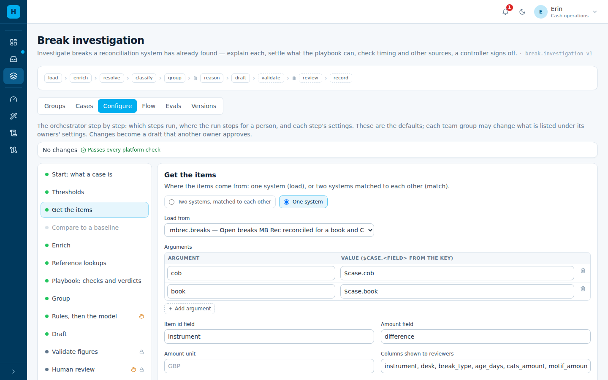
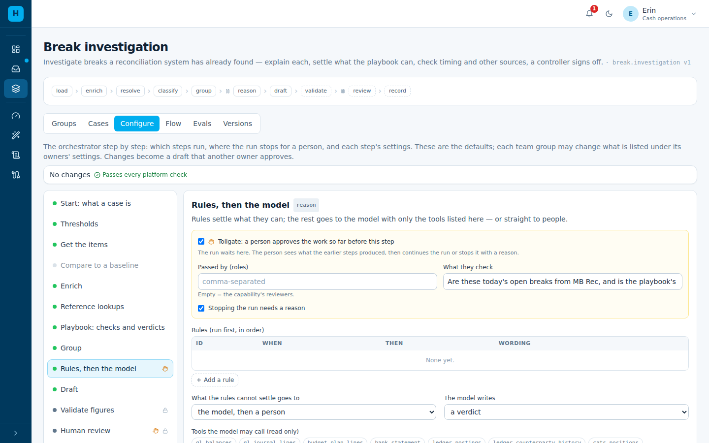
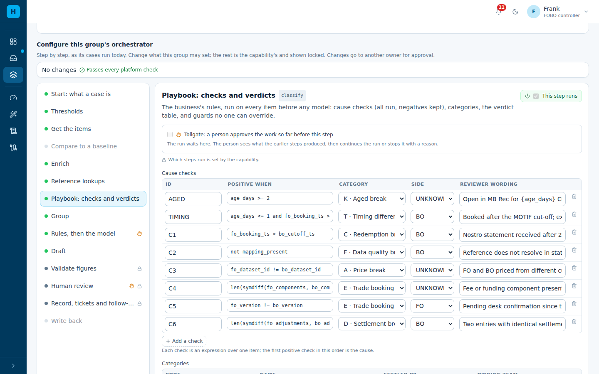
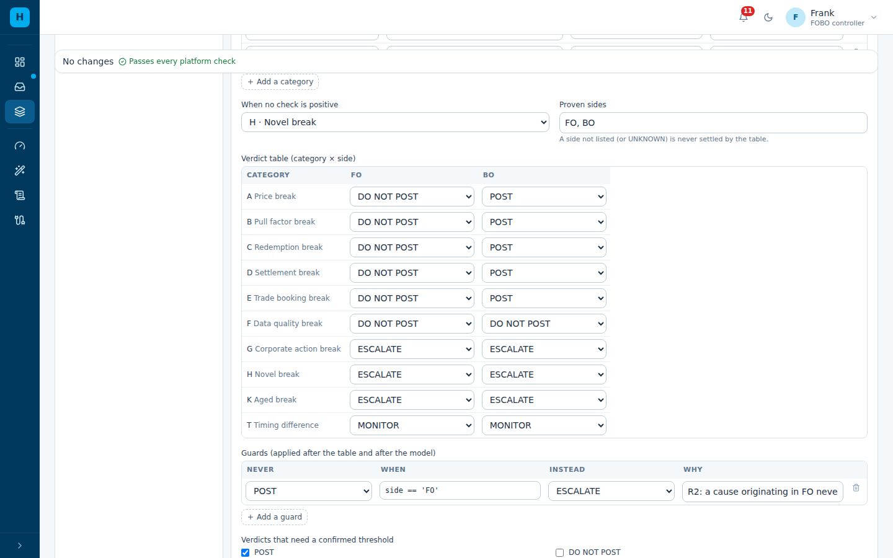
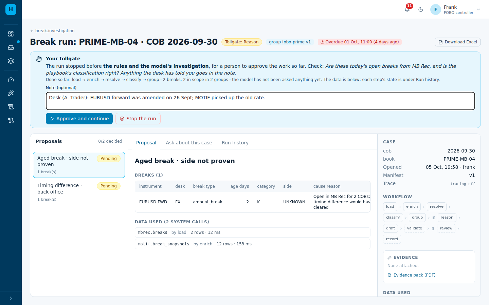
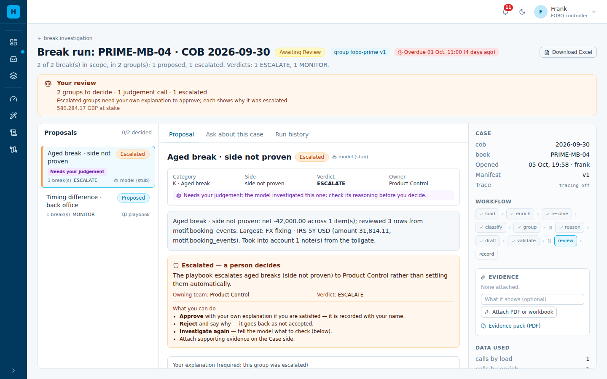

# Configure it: FOBO on MB Rec's breaks

**Date:** 2026-10-05 · **For:** the capability owner and the FOBO Prime group owner.

The rules come from the controllers' FOBO Investigation Skill. How each of its sections maps
to this configuration: [`../fobo-skill/skill-to-agent-one-finance.md`](../fobo-skill/skill-to-agent-one-finance.md).

**The situation.** MB Rec has already reconciled CATS (front office) to MOTIF (back office).
What is left is the manual part a controller does each morning:

- why does each break exist?
- is it a timing difference that will clear tomorrow?
- what do other sources say (booking events, snapshots, documents)?
- what did the desk or the trader say?
- who has to fix it?

Agent One Finance should do that part, and **never re-match the positions**.

**The shape:**

| | |
|---|---|
| **Capability** | *Break investigation* (`break.investigation`). It reads the breaks another system found. |
| **Team group** | *FOBO Prime — MB Rec breaks* (`fobo-prime`). FOBO's playbook, timing rules, tools and reviewers. |
| **Steps** | read MB Rec's breaks → join snapshots → desk and team as of the COB → playbook (timing first) → group → **tollgate: a controller approves and adds what the desk said** → rules, then the model → draft → validate → review → record |

Use *Reconciliation investigation* (with `match`) only where no system has reconciled the
data yet, as for cash bank vs ledger.

Everything below is done in the console, under **Capabilities**. Each change is checked as
you make it, and becomes live when a second owner approves it.

---

## Step 1 — Connect MB Rec (Agent One Finance team, once)

MB Rec is reached as an MCP server, like every other source. It needs one entry in
`config/agent-one-finance/connectors.yaml`. In the office, the URL and auth come from
`connectors.office.example.yaml`.

```yaml
mbrec:
  name: MB Rec — reconciled breaks
  transport: http
  url: https://mbrec-mcp.internal.example/mcp
  headers_env: { Authorization: MBREC_MCP_AUTHORIZATION }
  classification: confidential
  tools:
    breaks:        { description: "Open breaks for a book and COB", scope: { arg: book, key: book } }
    break_history: { description: "The last COBs of one instrument's break", scope: { arg: book, key: book } }
```

Two tools:
- **`breaks(book, cob)`** returns MB Rec's open breaks: CATS and MOTIF amounts, the
  difference, the break type, and how many COBs each break has been open (`age_days`).
- **`break_history(book, cob, instrument)`** tells a timing difference that clears from one
  that stays.

In dev, both are served by a stub (`agent_one_finance/stub_connectors/finance.py`).

## Step 2 — The capability: read the breaks, stop for a controller

*Capabilities → Break investigation → **Configure***. This is done by erin, a capability
owner.

**Get the items** — choose *One system* and **`mbrec.breaks`**, with `book = $case.book` and
`cob = $case.cob`. There is no matching step.



**Rules, then the model** — tick **Tollgate**:

- **What they check:** "Are these today's open breaks from MB Rec, and is the playbook's
  classification right? Anything the desk has told you goes in the note."
- **Passed by:** left empty, which means the group's reviewers (FOBO controllers).
- **Stopping the run needs a reason:** on.

The run now waits before the model is asked anything.



The rest is set by each team group: the playbook, tools, instructions, reviewers and
deadline. The capability's *Owners* step lists them under "Team groups may set".

## Step 3 — The FOBO Prime group: timing, sources, the desk

*Capabilities → Break investigation → Groups → FOBO Prime — MB Rec breaks*. This is done by
frank, a group owner. Settings the capability keeps are shown locked.

**Playbook: checks and verdicts.** Timing comes first, because the first positive check is
the cause:

| Check | Positive when | Category | Side | What it means |
|---|---|---|---|---|
| `AGED` | `age_days >= 2` | K · Aged break (judgement) | not proven | Open two COBs or more: not "just timing"; the model investigates and a person decides |
| `TIMING` | `age_days <= 1 and fo_booking_ts > bo_cutoff_ts` | T · Timing difference | BO | Booked after the MOTIF cut-off; expected to clear on the next COB |
| `C1`…`C6` | FOBO's six cause checks | A–F | as before | unchanged |



**Verdict table.** T (timing) → **MONITOR** on both sides: no adjustment, watch it clear. K
(aged) → **ESCALATE**, owner Product Control. FOBO's rows A–H are unchanged, and the R2 guard
still applies: a front-office cause never posts.



**Rules, then the model:**

- **Tools:** `motif.booking_events` (what happened in MOTIF) and `mbrec.break_history` (did
  this break clear before?). Add any other onboarded source here, such as a documents folder
  or the office RAG.
- **Instructions:** propose POST, DO_NOT_POST, **MONITOR** or ESCALATE; use the break history
  to tell timing from a real break; weigh the controller's tollgate notes, but cite figures
  only from the tools.
- **Specialist:** *booking-events*, which reads the booking events for a break.

**Start: what a case is.** A case **opens when MB Rec posts its end-of-day run** (*Opens: when
an event arrives*), not on a fixed schedule, because the breaks exist only once MB Rec has
reconciled. It is due by 11:00 the business day after the COB.

**Human review and follow-up** — the same as FOBO today:
- reviewers are `FOBO_CONTROLLER`;
- a verdict under an unconfirmed threshold needs a tick and a comment;
- DO_NOT_POST and escalations raise a ticket for the owning team.

Then *Review and submit*. Another group owner approves.

## Step 4 — How a morning runs

1. **MB Rec finishes PRIME-MB-04 for 30 Sept** and calls Agent One Finance:

   ```bash
   curl -X POST https://aof.internal.example/api/events \
     -H "X-AOF-Event-Secret: $AOF_EVENT_SECRET" -H 'Content-Type: application/json' \
     -d '{"capability_id": "break.investigation", "team_group": "fobo-prime",
          "case_key": {"book": "PRIME-MB-04", "cob": "2026-09-30"}}'
   ```

2. **Agent One Finance reads the breaks, joins the snapshots, resolves the desk and runs the playbook.**
   In this example:
   - **JGB 10Y** was booked after the cut-off and is new: **timing difference**;
   - **EURUSD FWD** has been open 2 COBs: **aged**.

3. **Tollgate.** The case is in the controller's inbox as *Tollgate*. They check the
   classification and **add what the desk said**, for example "EURUSD forward was amended on
   26 Sept; MOTIF picked up the old rate". Then they *Approve and continue*, or stop the run
   with a reason.

   

4. **Rules, then the model.**
   - The timing break is settled by the verdict table: **MONITOR**.
   - The aged break goes to the model. It reads MOTIF's booking events and MB Rec's history,
     **with the desk's note as context**, and proposes an explanation.
   - Validation checks every figure it cites.
   - The case is escalated to a person, because an aged break is a judgement call.

   

5. **The controller signs off.** Tickets go to the owning teams, the decisions are recorded,
   and tomorrow's run learns from them.

## Your three situations

| Situation | How it is configured now | Not yet in Agent One Finance |
|---|---|---|
| **Timing difference** | `TIMING` check → category T → **MONITOR**; `AGED` check sends anything open 2+ COBs to a person; *Recurring items* shows a break that keeps coming back; the model reads `mbrec.break_history`. **Follow-through** re-tests every MONITOR on the next COB: cleared shows on the earlier case, and one still open becomes `MONITOR_NOT_CLEARED` → K, for a person | — |
| **Other sources** | Each source is a connector tool; add it to *Enrich* (joined onto every break) or to the model's tools (read when needed). A controller can attach a file to the case | A source with no MCP server needs one, onboarded once |
| **Trader provides the info** | The controller writes it in the **tollgate note**, or **asks the desk from the case** (*Questions → Ask for evidence*). The group waits; the trader answers in Agent One Finance (or a Teams/email bot answers for them); the answer goes to the model. See the [walkthrough](fobo-capability-walkthrough.md) | — |

## The same as files

| What | File |
|---|---|
| The capability | `config/agent-one-finance/capabilities/break-investigation.yaml` |
| The FOBO Prime group | `config/agent-one-finance/groups/break.investigation/fobo-prime.yaml` |
| The connector | `config/agent-one-finance/connectors.yaml` (`mbrec`) |
| Behaviour tests | `apps/backend/tests/agent_one_finance/test_break_investigation.py` |

To bring changed files into a running deployment, run `python -m agent_one_finance.config_sync`, then
approve the drafts. New capabilities and groups arrive as version 1 drafts.

Rates is the second group, configured the same way: `groups/break.investigation/fobo-rates.yaml`.
