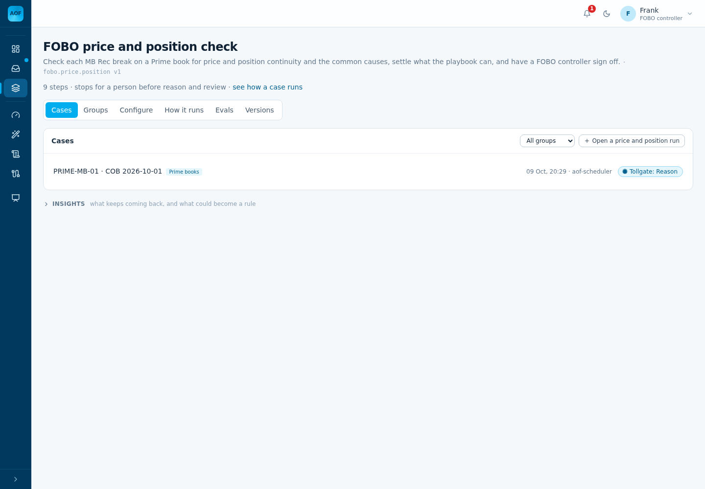
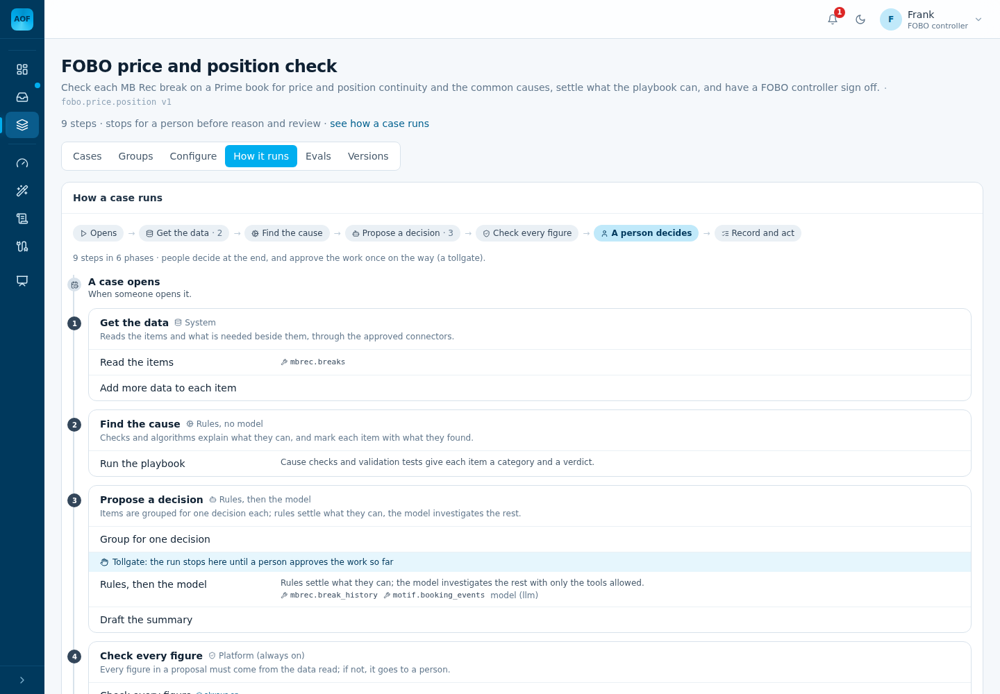
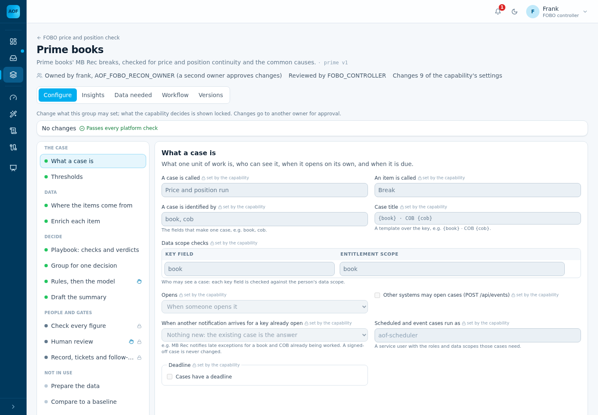
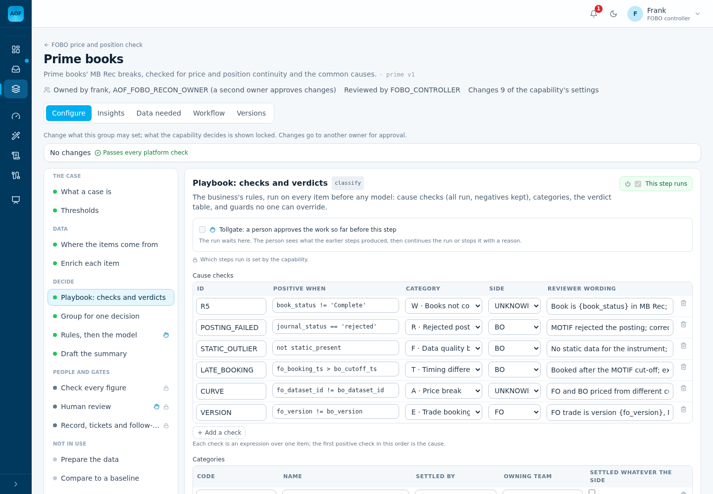
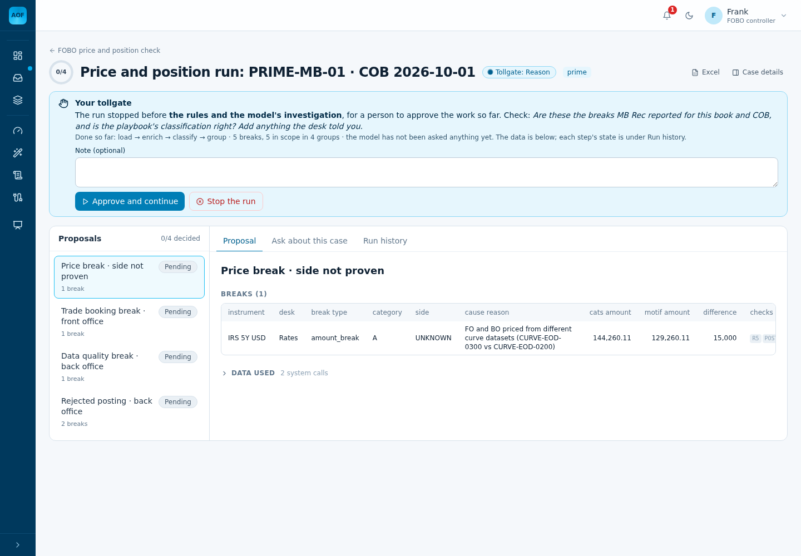
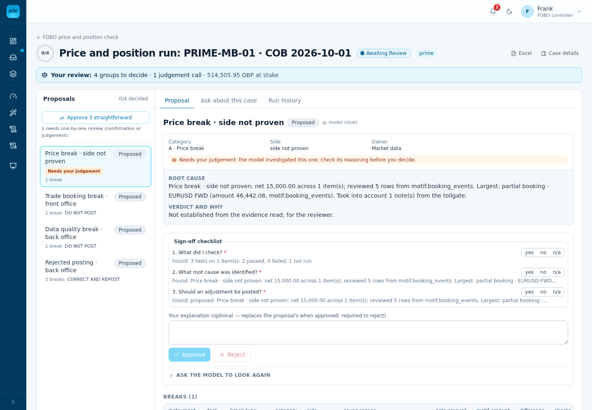
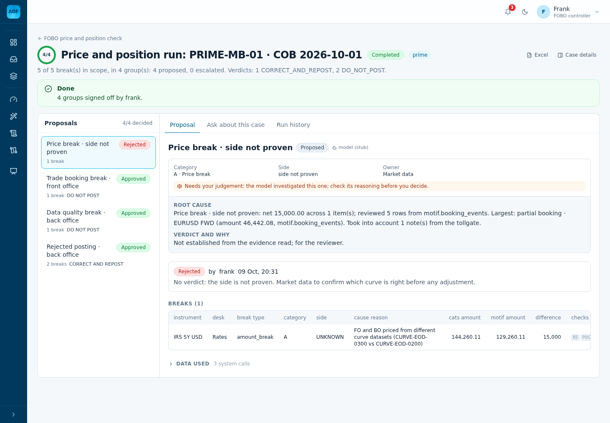
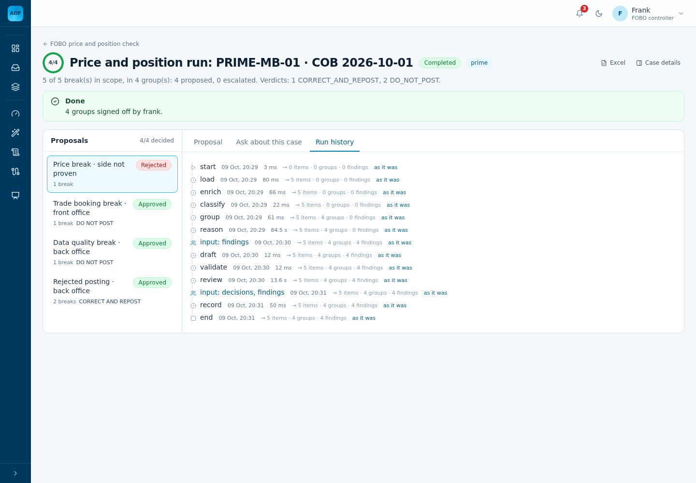

# Example: the FOBO price and position check, set up for real

This folder is one capability set up end to end on an empty AOF. Every output and screenshot below comes from one
run, made on 9 Oct 2026 with [`setup_example.py`](setup_example.py) through AOF's own API. The console screenshots
were taken along the way. The outputs are what the script prints, with a few long lines cut.

| File | What it is |
|---|---|
| [`capability.yaml`](capability.yaml) | The capability: what one case is, where the breaks come from, the steps, where a person approves, who signs off |
| [`group.yaml`](group.yaml) | The Prime controllers' rules: the data joined to each break, the checks and tests, categories, verdicts, the sign-off questions |
| [`setup_example.py`](setup_example.py) | Does every step below through the API, as the right person each time. Run it against any AOF. |
| [`img/`](img/) | The console at each stage |

**What it does.** For one Prime book on one COB, it reads MB Rec's open breaks and joins MOTIF's FO/BO snapshot to
each. It then runs six of the FOBO skill's checks and three of its tests, and groups the breaks by cause. The verdict
table settles what it can, and the model looks at the rest. A FOBO controller approves the classification at a
tollgate and signs off each group.

It is a slice of the FOBO Investigation Skill. The full version is
`config/agent-one-finance/groups/break.investigation/fobo-prime.yaml`. This example is small enough to read in one
sitting.

**About this run:**
- The MCP tools are the stub MB Rec and MOTIF servers that ship with AOF. In the office they are the real ones, with
  the same tool names.
- The model is the stand-in (`AOF_LLM_ADAPTER=stub`). It reads the tools and fills the sections, but it does not
  reason or choose a verdict. Step 7 shows what changes with the bank's model connected.

---

## Before you start

| You need | In this run | In the office |
|---|---|---|
| AOF running, with a database | Local AOF on an empty database (`alembic upgrade head`) | UAT AOF |
| The MCP tools onboarded: `mbrec.breaks`, `motif.break_snapshots`, `mbrec.break_history`, `motif.booking_events` | The stub servers in `connectors.yaml` | The MB Rec and MOTIF MCP servers in `connectors.yaml`. The capability names tools only; it does not change. |
| Two people with `AOF_FOBO_RECON_OWNER`: one submits, the other approves | frank and gina | Two capability owners (real bank ids) |
| Controllers with `FOBO_CONTROLLER` | frank | The FOBO controllers |

---

## Step 1. Write the capability

[`capability.yaml`](capability.yaml), block by block:

| Block | Says | From the skill |
|---|---|---|
| `owners` | frank, or anyone with `AOF_FOBO_RECON_OWNER`, may change it. `four_eyes`: whoever submits a change cannot approve it. | Governance |
| `case` | One case is one book on one COB (`key: [book, cob]`). A controller sees only the books in their data scope. | §2 scope |
| `items.load` | Step 1 calls the MCP tool `mbrec.breaks(book, cob)`. Each row is a break, identified by `instrument`, with the amount in `difference`. | §3 the input |
| `steps` | `load, enrich, classify, group, reason, draft, validate, review, record`. The engine builds the LangGraph graph from this list, one node per step, in this order. | §4 the method |
| `pause_before: [reason, review]` | The run stops before the model is asked anything (a tollgate) and before sign-off | R5, §14 |
| `tollgates.reason.check` | The question shown to the controller at the tollgate | §4 |
| `reasoning` | The model may use only `mbrec.break_history` and `motif.booking_events`. It sees only the groups the playbook could not settle. | §7, R6 |
| `review.roles` | `FOBO_CONTROLLER` signs off. A reject or an escalation needs a comment. | §14 |
| `configurable` | What a team group may set for its own books | |

## Step 2. Submit it, then a second owner approves it

Real output:

```
[1] frank: submits capability.yaml (9 steps: load, enrich, classify, group, reason, draft, validate, review, record)
    stored as fobo.price.position version 1, status draft

[2] frank: tries to approve his own draft
    HTTP 403: four-eyes: the drafter cannot approve their own change

[3] gina: approves it
    fobo.price.position version 1 is live
```

Before storing it, AOF checks the YAML against every platform rule (`POST /api/authoring/submit`). For example, it
refuses:
- a step that does not exist;
- a tool that is not onboarded ("tool `x` is not an onboarded connector tool");
- a setting no step uses ("`enrich` is set but the workflow has no `enrich` step").

**In the console:**
1. **Authoring**, then **Start from a template**. Pick any template, replace the manifest text with
   `capability.yaml`, then **Submit for approval**.
2. The second owner opens **Authoring**, then **Drafts awaiting approval**, then **Approve**.



**How it runs** draws the steps in the YAML as the run sees them: where the data comes from, where the rules decide,
where the tollgate is, and which tools the model may use.



## Step 3. Write the team's rules, check them, submit, approve

[`group.yaml`](group.yaml) is what the Prime controllers decide. Each part belongs to one step:

| Part | Step | Says |
|---|---|---|
| `enrich` | enrich | Join the MCP tool `motif.break_snapshots(book, cob)` to each break by `instrument` |
| `policy` | classify | `mtm_market_movement_tolerance` is empty: Product Control has not confirmed it. Rule P1: never guessed. |
| `playbook.checks` | classify | Six checks, in order. The first that is true gives the break its category and side. The others still run and are kept as evidence. |
| `playbook.tests` | classify | FO-1 position, FO-2 price and FO-4 MTM run on every break: pass, fail, or not run and why |
| `playbook.categories` and `verdicts` | reason | What each category means, who owns it, and the verdict for each side |
| `guards` | reason | R2: a cause that starts in the front office never posts. This is code, not the model. |
| `group_by`, `group_label` | group | One decision per category and side, named in business words |
| `reasoning.sections` | reason | What the model must write for each group it investigates |
| `review.checklist` | review | The questions the controller answers before approving, with what AOF already knows next to each |

Real output:

```
[4] frank: checks group.yaml (prime) against the live capability, then submits it
    check: passes every platform check
    stored as group prime version 1, status draft

[5] gina: approves the group
    group prime version 1 is live
```

The six checks:

| Check | True when | Category | Side |
|---|---|---|---|
| R5 | `book_status != 'Complete'` | W Books not complete | not proven |
| POSTING_FAILED | `journal_status == 'rejected'` | R Rejected posting | BO |
| STATIC_OUTLIER | `not static_present` | F Data quality | BO |
| LATE_BOOKING | `fo_booking_ts > bo_cutoff_ts` | T Timing difference | BO |
| CURVE | `fo_dataset_id != bo_dataset_id` | A Price break | not proven |
| VERSION | `fo_version != bo_version` | E Trade booking | FO |

The group page shows what the group sets. What the capability decides is shown locked. The playbook is edited here as
a form, and every change goes to another owner.





## Step 4. A case opens

```
[6] aof-scheduler: opens a case for PRIME-MB-01 COB 2026-10-01 (here by hand; an MB Rec event can do it instead)
    case fobo.price.position.ad5a74cf021c: PRIME-MB-01 · COB 2026-10-01
```

In the console: the capability page, then **Open a price and position run**, with the book and COB. Here the
scheduler account opens it, so that frank can sign it off: whoever opens a case cannot sign it off (maker-checker).
To have MB Rec's end-of-day event open it instead, see "Make it yours" below.

## Step 5. The run, up to the tollgate

```
[7] the run: load, enrich, classify, group done; status paused_before_reason
    MCP tool mbrec.breaks(cob=2026-10-01, book=PRIME-MB-01) -> 5 rows, 31 ms
    MCP tool motif.break_snapshots(cob=2026-10-01, book=PRIME-MB-01) -> 12 rows, 26 ms
```

| Break | Difference | First true check | Category · side | Tests |
|---|---:|---|---|---|
| EURUSD FWD | 77,243.37 | POSTING_FAILED | R · BO | FO-1 pass, FO-2 pass, FO-4 not run (policy unset) |
| GBPUSD FWD | 366,608.11 | POSTING_FAILED (CURVE also true) | R · BO | FO-1 pass, FO-2 pass, FO-4 not run |
| IRS 5Y USD | 15,000.00 | CURVE: CURVE-EOD-0300 vs CURVE-EOD-0200 | A · not proven | FO-1 pass, FO-2 pass, FO-4 not run |
| UST 10Y | −13,654.47 | STATIC_OUTLIER (CURVE also true) | F · BO | FO-1 pass, FO-2 pass, FO-4 not run |
| UST 2Y | −42,000.00 | VERSION: FO version 3, MOTIF version 2 | E · FO | FO-1 pass, **FO-2 fail**, FO-4 not run |

So far:
- Two MCP calls.
- No model.
- Five breaks in four groups.

FO-4 shows "not run" on every break because the tolerance is empty. That is rule P1 working: a test with no
threshold never passes by default.



## Step 6. The controller passes the tollgate

```
[8] frank: checks the breaks and the classification at the tollgate, and lets the run go on
```

frank adds a note. The model reads it as context. The note in this run is an example: "Breaks match MB Rec for the
book. Desk says the IRS 5Y was re-marked on the 03:00 curve."

To stop the run instead, the controller presses **Stop the run** and gives a reason. It can be re-run later.

## Step 7. Reason, draft, validate

```
[9] the run: reason, draft and validate done; waiting for the controller
    Price break · side not proven            items IRS 5Y USD
        verdict None  status proposed  decided by llm:stub  model investigated
    Trade booking break · front office       items UST 2Y
        verdict DO_NOT_POST  status proposed  decided by playbook
    Data quality break · back office         items UST 10Y
        verdict DO_NOT_POST  status proposed  decided by playbook
    Rejected posting · back office           items EURUSD FWD, GBPUSD FWD
        verdict CORRECT_AND_REPOST  status proposed  decided by playbook
```

Three groups were settled by the verdict table, with no model.

The fourth, the IRS 5Y USD price break, has no proven side. FO or BO could have used the wrong curve, so the table
cannot decide, and the model investigates it.
- **In this run:** the stand-in model listed what it read and gave no verdict. It skipped `mbrec.break_history`, which
  needs an instrument the stand-in cannot choose.
- **With the bank's model connected (`AOF_LLM_ADAPTER`):** the model reads both tools and writes the root cause. It
  proposes a verdict: DO_NOT_POST if FO used the wrong curve, POST if BO did. R2 still applies, and a person still
  decides.

`validate` checks that every figure in a proposal came from data the run read. One that did not would go to a person.

The review screen:
- shows the money at stake (514,505.95 GBP);
- marks the one judgement call;
- offers **Approve 3 straightforward** for the rest;
- shows the checklist, with what AOF already knows next to each question.



## Step 8. Sign-off and record

```
[10] frank: signs off each group with the checklist
    Price break · side not proven            reject -> HTTP 201
    Trade booking break · front office       approve -> HTTP 201
    Data quality break · back office         approve -> HTTP 201
    Rejected posting · back office           approve -> HTTP 201

Case fobo.price.position.ad5a74cf021c: completed (completed).
```

frank approved the three playbook verdicts and answered the checklist for each. He rejected the price break with his
reason: "No verdict: the side is not proven. Market data to confirm which curve is right before any adjustment." A
reject needs a comment (`review.require_comment`).



**Run history** has one line per LangGraph node. Each line is a saved checkpoint for this case, shown "as it was".
- The two "input" lines are the people: the tollgate, then the decisions.
- The time on `reason` and `review` includes the wait for those people.



---

## Run it yourself

```bash
pip install pyyaml        # the AOF backend already has it

# all of it, against a local AOF
python setup_example.py --api http://localhost:8300

# or stop on the way and look at the case in the console
python setup_example.py --until tollgate
python setup_example.py --case <case id> --until review
python setup_example.py --case <case id>

# UAT: the AOF internal address, the proxy secret, real ids
python setup_example.py --api https://<aof address> --proxy-secret "$AOF_TRUSTED_PROXY_SECRET" \
  --maker <owner 1> --checker <owner 2> --opener <service account> --book <book> --cob <yyyy-mm-dd>
```

Notes:
- Re-running skips the capability and the group if they are already live.
- There is one case per book and COB. Opening the same book and COB again returns the case that exists; use another
  `--cob`, or **Re-run** in the console for a new attempt.
- `--record run.json` saves every request and answer.
- In UAT, `owners.people` in both YAML files names `frank`. Change it to the first owner's bank id before running, or
  rely on the role alone.

## Make it yours

Each change is a new version, checked by AOF and approved by a second owner.
- A change to the group can only set what the capability lists in `configurable`. AOF refuses anything else, for
  example "`case.opens_on` is not configurable for fobo.price.position".
- So some changes need a new capability version first, to add to `configurable`.

Each change below passes AOF's checks with the files in this folder:

| To | In the capability | In the group |
|---|---|---|
| Run FO-4 | | Set `policy.mtm_market_movement_tolerance.value` once Product Control confirms it |
| Send aged breaks to a person | | A check `AGED` (`age_days >= 2`, category K, judgement, verdict ESCALATE) before the cause checks |
| Add the rest of the skill's tests | | FO-3 and FO-5…FO-8, BO-1…BO-6: copy them from `fobo-prime.yaml` |
| Have MB Rec's end-of-day event open the case | Add `case.opens_on`, `case.events` and `case.opens_as` to `configurable` | `case: { opens_on: event, events: true, opens_as: aof-scheduler }`. MB Rec then posts the book and COB to `POST /api/events`. |
| Give the case a deadline | Add `case.due` to `configurable` | `case.due: { from: cob, business_days: 1, at: "11:00" }` |
| Raise a ticket for DO_NOT_POST and escalations | Add `escalation` to `configurable` | An `escalation` block with `ticketing.create_ticket` |
| Ask the desk a question from the case | Add `requests` to `configurable` | A `requests` block (targets: desk, operations) |
| Catch a break booked to the wrong instrument | Add an `offsets` step after `enrich` (type `offsets`, amount `difference`, within `book`) | A check `OFFSET` (`when: offset`, category O, judgement) |

The last row is worth showing on real data. On COB 6 Oct, the same book has UST 10Y at +71,124.74 and JGB 10Y at
−71,124.74. This example calls both "Novel break". With the `offsets` step they become one "Booked to the wrong
instrument" group.

Each of these is already in `fobo-prime.yaml`, the full FOBO set-up.
