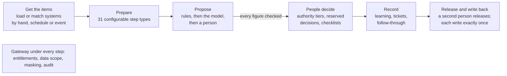

# Agent One Finance: governed AI for Finance

**Date:** 2026-10-06 · Shared version: [Claude Docs](https://claude.ai/code/artifact/05a731bc-1630-4127-9ace-757b27dd26ea) · Design detail: [step catalogue v2](design/step-catalogue-v2.md)

## Summary

Agent One Finance gives every Finance team one governed way to run its case-based work: product control, financial control, financial reporting, treasury and accounts payable. FOBO is one use case: the first capability on the platform. It pulls the data in, prepares it, and proposes what to do: rules first, then the model, then a person. Named people decide, and only an approved outcome is ever written back. A team gets this by **configuration, not code**.

Today's build:

- **44 building blocks.** 13 core steps every case can use, plus 31 configurable step types in 6 families.
- **Governance built in**: segregation of duties, the authority matrix, reserved decisions, release before write-back, audit, masking and retention.
- **Eight capabilities running**, seven of them in Finance:
  - product control: FOBO break investigation (Prime and Rates);
  - financial control: reconciliation, month-end accruals, control operating test;
  - financial reporting: P&L variance commentary, report validation;
  - treasury and payments operations: payment exceptions;
  - beyond Finance, the same platform: complaint handling.
- **18 further use cases** mapped onto the same blocks (section 6), most of them in Finance.

## The problem

Much of Finance's control and operations work is the same job in different clothes:

- a list of items arrives (breaks, exceptions, alerts, complaints, journals, samples);
- someone gathers data from three to six systems;
- someone works out what happened;
- a person with the right authority decides;
- the outcome is written back to a system of record.

Today each team does this by hand, in spreadsheets and email, or with its own tool. The work is slow, and the evidence is scattered. Controls such as four-eyes, authority limits and audit trails are rebuilt by every team, and checked differently by each auditor.

A model can now do much of the gathering and first reasoning. But on its own it brings new risks to a bank:

- figures that are not grounded in data;
- decisions taken without authority;
- writes nobody approved;
- no record of what it looked at.

The job is to give every team that speed inside one set of controls.

## What Agent One Finance provides

Every use case gets the same platform. A team describes its work as a **capability**: what a case is, where the items come from, the steps, who decides and what is written back. Agent One Finance runs it the same way every time.

A tollgate can stop the run before any stage for a named person; nothing is written until a second person releases it.

| Service | What every capability gets |
| --- | --- |
| Cases | One case per unit of work (a book and date, an entity and period, a client). Opened by hand, on a schedule, or by another system's event. Deadlines, re-runs as new attempts, follow-up cases for late items |
| Data access | Every read through one gateway to MCP connectors: entitlements, data scope per user, masking, and an audit row per call. Systems stay the source of truth |
| Proposals | Items grouped into one decision per pattern. Rules first, then the model with read-only tools, then a person. Every figure is checked against the data before anyone sees it |
| Human review | Approve, reject, send back to the model, ask a desk or another team for evidence, sign-off checklists, bulk approval with exclusions, delegation while away |
| Tollgates | The run stops before any step for a named person to approve the work so far |
| Write-back | Only approved outcomes, only after a second person releases them, each write once |
| Learning | Approved explanations reused next time, recurring items, unexplained items, rule candidates, decisions re-checked on the next run |
| Evidence | Uploads, an evidence-pack PDF, reports kept with the case, retention and legal hold, run history step by step |
| Configuration | Configure forms (no YAML needed), guided authoring with or without a model, every change checked as it is made and approved by a second owner, versions and diffs |
| Operations | Notifications in the app, Teams or email; cost limits and off switches; eval sets and shadow runs before go-live; tracing |

## Building blocks

A capability is a chain of generic steps. A team adds the ones its work needs, in order, with a form for each. A step can run only when a condition holds. No step holds one team's logic: thresholds are named policy values, logic is expressions, and anything else is the team's own service called through the gateway.

| Family | Steps | What it is for |
| --- | --- | --- |
| Core | load, match, enrich, resolve, classify, compare, group, reason, draft, validate, review, record, publish | Get the items or match two systems, add context, run a playbook, propose, check, decide, record, write back |
| Data | reference data, computed fields, filter, currency conversion, bands, duplicates, roll-up, team's own tool | Prepare the items: rates, limits, ageing, service-level bands, scope, the team's own scoring |
| Accounting | recompute and compare, schedule over periods, period open?, journal entries, post journals | Fees and interest checked against tariffs; accruals, prepayments and reserves as balanced journals; posting after release |
| Assurance | change over periods, unusual against history, consistency checks, sample, risk score, owner attestation | Flux review, anomalies, cross-report rules, control testing samples, risk-based review, sign-off by owners |
| Orchestration | wait for an event, child cases, draft a message, report | Wait for a reply or confirmation; one child case per account, sample or client; outbound drafts; a PDF pack |
| Acquisition | match several systems, file intake, read a document | Three-way and intercompany matching, workbooks from other teams, values from contracts and statements |
| Time and parties | clocks, timeline, related cases, name screening, send to the other party | Service-level and regulatory clocks, one timeline across systems, earlier cases on a client, candidate matches, approved outreach |

New step types are added once, through a small SDK, and then every team can use them.

## Controls built in

These hold for every capability, whatever its steps. A team cannot configure them away.

1. **People decide.** The model proposes, a person decides. When nothing settles a group, it goes to a person, not a guess.
2. **Authority.** Tiers by amount, risk or verdict say who may approve and how many different people must. The matrix is held in Agent One Finance, or read from the bank's delegated-authority system.
3. **Reserved decisions.** Credit, sanctions, AML, redress above a limit, payment release: only named roles decide, never in bulk. The model's proposal is withheld where it may not propose.
4. **Segregation of duties.** The opener may be barred from signing off. Whoever releases a write-back did not review the case.
5. **No silent writes.** Writes only through tools marked as writes, only by the release, posting or outreach step, after approval. Each write is idempotent; a ledger's own check runs first.
6. **Grounded figures.** Every figure in a proposal is traced to the data. Values read from documents must appear in the document; low-confidence or regulated values go to a person.
7. **Nothing dropped.** Items set aside stay on the case with the reason. Samples keep their seed, so they can be reproduced.
8. **Data protection.** Entitlements and data scope per user, masking of protected fields before any model sees them, an audit row for every call.
9. **Change control.** Every configuration change is checked as it is made and approved by a second owner. A case keeps the version it ran on.
10. **Model risk.** Eval sets and shadow runs before go-live, cost limits, off switches, instructions versioned and approved.

## Use cases by Finance area

Each row is built only from the blocks above. The last rows show the same platform beyond Finance. “Running” means a capability exists in Agent One Finance today; the others need configuration and connectors to the team's systems, no new platform code.

| Area | Use case | Steps that carry it | Who decides | Written back |
| --- | --- | --- | --- | --- |
| Product control | FOBO break investigation (running) | load breaks, enrich, playbook, tollgate, reason, follow-through | Product control | Tickets to owning teams |
| Product control | Independent price verification | reference data ×3 vendors, computed fields, recompute vs desk mark, classify, journal entries | Valuation control | Valuation reserves (posted) |
| Product control | Limit breach investigation | reference data, change over periods, reason, authority tiers, follow-through | Risk, by authority | Temporary excess decision |
| Financial control | Reconciliation investigation (running) | match two systems, rules, reason, follow-through | Finance operations | Write-offs within limit |
| Financial control | Month-end accruals (running) | period open?, chart and authority data, journal entries, post | Reviewers by authority; controller releases | Journals to the ledger |
| Financial control | Balance-sheet substantiation | change over periods, risk score, child case per account, attestation, report | Account owners | Sign-off pack |
| Financial control | Intercompany matching | match several systems, currency, roll-up, journal entries | Both entities' owners | Elimination journals |
| Financial control | Manual journal review | risk score, sample, reason | Financial control | — |
| Financial control | Close calendar | parent case per entity, child tasks, wait for children, roll-up sign-off | Entity, region, group | Close sign-off |
| Financial reporting | P&L variance commentary (running) | compare to budget, reason in sections | Finance reviewers | Commentary to the reporting pack |
| Financial reporting | Report validation (running) | match workbook to GL, reason | Reporting | PDF report |
| Finance controls | Control operating test (running) | sample, child case per sample, wait for all, attestation, report | Testers; control owner attests | Test report |
| Finance controls | Regulatory report validation | data sets, consistency checks, attestation, report | Report owner | Attestation pack |
| Treasury and payments | Payment exceptions (running) | rates, duplicates, filter, currency, age, service-level bands, team's risk score | Payments operations | Repair instruction (released) |
| Treasury and payments | Payment investigation | timeline, 24 h clock, outreach to the other bank, wait for reply | Payments operations | Customer reply |
| Treasury and payments | Nostro reconciliation | match, bands, risk score, authority lanes | Cash operations | Write-offs |
| Accounts payable | Three-way match | match several systems (order, receipt, invoice), computed variances | Accounts payable | Block or release in purchasing |
| Accounts payable | Invoice capture | file intake or read a document, duplicates, match | Accounts payable | Invoice to purchasing |
| Beyond Finance: operations | Failed settlement | enrich, classify cause, market cut-off clock, outreach | Settlements | — (re-checked next day) |
| Beyond Finance: client service | Complaint handling (running) | timeline, related complaints, 8-week clock, fee recompute, screening, acknowledgement after approval | Handler; lead above the limit | Messages to the client |
| Beyond Finance: client service | Fee and interest refunds | recompute from the tariff, draft client notice | Service, by authority | Refund instruction |
| Beyond Finance: lending | Covenant monitoring | read the borrower's pack, computed ratios, classify breach | Credit officer (reserved) | Credit memo; re-checked next quarter |
| Beyond Finance: financial crime | AML alert triage pack | timeline, related parties, screening candidates; model writes the narrative only | Analyst (reserved) | — |
| Beyond Finance: financial crime | KYC periodic review | child case per client, outreach for documents, read documents | KYC officer (reserved) | Review outcome |
| Beyond Finance: technology risk | User access review | child case per manager, attestation per line, report | Managers | Revocations (released) |
| Beyond Finance: operational risk | Loss event capture | file intake, computed losses, currency, reporting clock, attestation | Business owner | Event record |

## Running today

Eight capabilities run on the platform. They use stub connectors here, and have office connector examples ready. Each one shows a different part of what the platform does.

| Capability | Area | What it shows |
| --- | --- | --- |
| Break investigation (FOBO) | Product control | A full playbook (checks, categories, verdict table, guards); team groups for Prime and Rates; a tollgate before the model; follow-through on the next business day; tickets to owning teams |
| Reconciliation investigation | Financial control | Agent One Finance matches two systems itself; rules settle write-offs within limit, and nothing is written off twice |
| P&L variance commentary | Financial reporting | Commentary in sections, published to the reporting pack after a second person releases it |
| Report validation | Financial reporting | A workbook matched to GL balances; a PDF report written after release |
| Payment exceptions | Treasury and payments | The first non-finance capability, built only from data steps; uses the payments team's own risk service |
| Month-end accruals | Financial control | A closed period stops the run; balanced journals; the bank's authority matrix with two approvers over 250k; posted after a controller releases |
| Complaint handling | Beyond Finance | A timeline the model reads; related complaints; the 8-week clock; screening candidates; acknowledgements sent only after approval; redress above the limit reserved for the lead |
| Control operating test | Finance controls | A reproducible sample; one child case per sample; the parent waits for them all; the control owner attests; a PDF report |

## How a team adopts it

A new use case needs configuration and, at most, a connector to each system it reads or writes. The platform team is needed only for a connector or a new step type.

1. **Describe the work.** Pick one of three ways to start:
   - answer guided questions (no model needed);
   - paste a business requirements document for a model to draft from;
   - start from a template.

   Agent One Finance checks the draft against every platform rule.
2. **Connect the systems.** Each system is an MCP connector, onboarded once. Its tools are marked read or write, and each is scoped to entities, books or clients.
3. **Configure the steps.** In *Configure*, pick steps from the families, fill their forms, and set:
   - the reviewers;
   - authority tiers or the bank's matrix;
   - reserved decisions;
   - tollgates;
   - what is written back and who releases it.
4. **Approve the version.** A second owner approves it. Until then nothing runs on it.
5. **Prove it.** Run an eval set and shadow runs against past cases before go-live.
6. **Run it.** Cases open by hand, on a schedule or on another system's event.
7. **Improve it.** Learning panels show:
   - recurring items;
   - what nothing explained;
   - which judgement calls are approved unchanged often enough to become rules.
8. **Add team groups.** A team group runs the same capability with its own settings, within what the capability allows.

## Fit and limits

Agent One Finance fits work that comes as a list of items, each needing an investigation and a decision by an accountable person. It is not the right tool for everything.

- **Not a system of record.** Ledgers, payment engines, KYC and case-management systems keep their data and their own controls. Agent One Finance reads them, and writes only approved outcomes back.
- **Not an autonomous decision-maker.** Credit, sanctions, AML, fraud and payment release stay with named people. Agent One Finance prepares and evidences; it never clears a screening hit or releases a payment.
- **Not a workflow engine for everything.** Long multi-team processes are layered as parent and child cases. A process that is mostly forms and routing, with no investigation, is better served elsewhere.
- **Not real-time.** Cases run in seconds to minutes. Pre-trade or in-flight payment checks belong in the transaction path.

Each new use case still needs:

- connectors to its systems, with read and write marked;
- named owners;
- its policy thresholds confirmed (an unset one flags rather than defaults);
- its reserved decisions agreed with risk and compliance;
- an eval set before the model's proposals are relied on.
