# FOBO as an Agent One Finance capability — the walkthrough

**Date:** 2026-10-05 · **For:** Product Control (the skill's owners), the FOBO group owners, and the
Agent One Finance team.

This walks through the FOBO investigation as it is configured in Agent One Finance, screen by screen,
from the controllers' [FOBO Investigation Skill v1.0](../fobo-skill/fobo-investigation-skill-v1.0.md).
The section-by-section mapping of the skill is in [skill-to-helix.md](../fobo-skill/skill-to-helix.md).

## Two layers: the capability and the team group

| Layer | What it holds | Who owns it | FOBO |
|---|---|---|---|
| **Capability** | The shape of the work, the same for every team: where breaks come from, which steps run and in what order, the tollgate, the gates, retention, and what a team may change | Agent One Finance team and the capability owner (erin) | *Break investigation* (`break.investigation`) |
| **Team group** | One team's configuration of it: its books, thresholds, playbook (the skill's rules), the model's instructions and tools, reviewers, who may be asked, deadline | That team's owners (frank) | *FOBO Prime — MB Rec breaks* (`fobo-prime`) |

Rates is a second group on the same capability (`fobo-rates`), with its own books, thresholds and
reviewers.
Any team whose breaks come from a reconciliation engine can be a group of it too.

Both layers are edited in **Capabilities → *name* → Configure**. Each change is checked as it
is made. It is live only when a second owner approves it, and past cases keep the version they
ran on.

## Part 1 — The capability: *Break investigation*

Open *Capabilities → Break investigation → **Configure***. The pipeline is on the left:
- a green dot means the step runs;
- a lock means a gate that is always on;
- a hand means the run stops for a person.

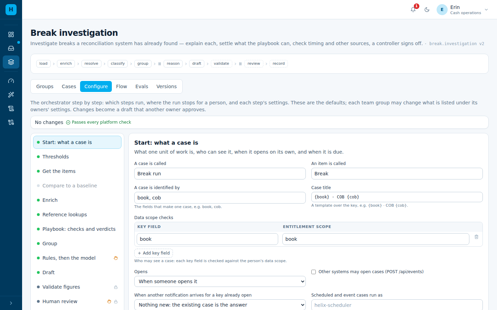

| Step | Set here | Why (skill) |
|---|---|---|
| **Start: what a case is** | A case is one **book × COB**; data scope by book. *When another notification arrives for a key already open:* **follow-up** (set by the group, below) | §4 step 1, the break universe per book and date |
| **Get the items** | *One system*: `mbrec.breaks` with `book`, `cob` — **no matching**; MB Rec already reconciled | Appendix B: MBREC produces the break population |
| **Enrich** | On. What is read is the group's: for FOBO, `motif.break_snapshots` joined on instrument (the dated FO/BO fields the tests read) | §5–§6 evidence |
| **Reference lookups** | On. The group's: book → desk → escalation team, **as of the COB** | §11 escalation routing |
| **Playbook** | On. Its rules are the group's | §5–§10 |
| **Group** | On. FOBO groups breaks by category and side, so one decision covers a pattern | R3 |
| **Rules, then the model** | **Tollgate** before it: a controller approves the breaks and the classification, and adds what the desk said | R4, R5; the controller stays in charge |
| **Validate figures** · **Human review** · **Record** | Gates, always on: every figure traced to data; a person decides every group; decisions recorded for the next run | R6, R7 |
| **Owners and team settings** | Owners (four-eyes), and **what each team group may set** | — |

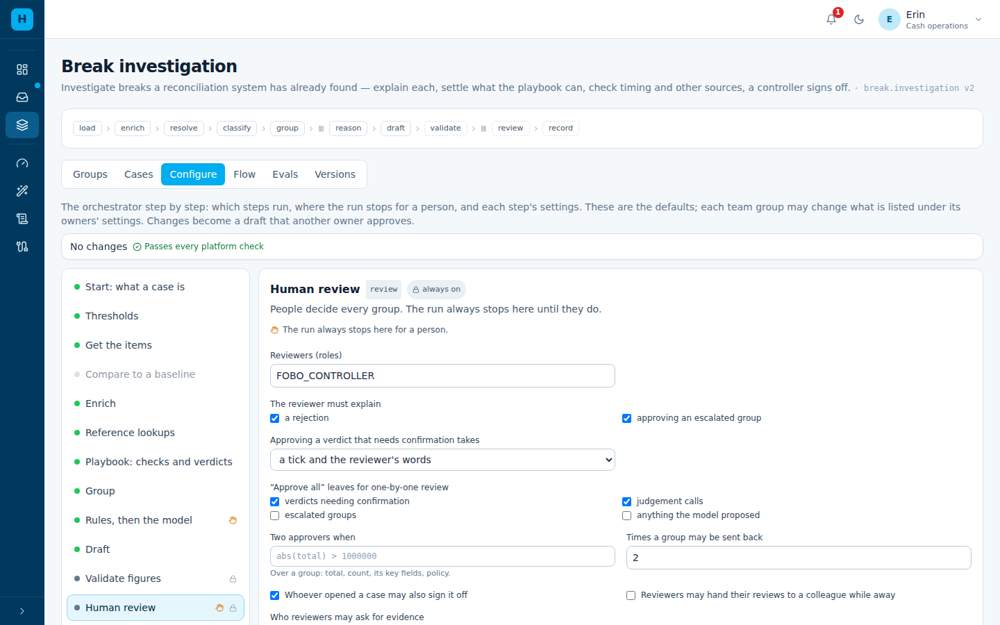

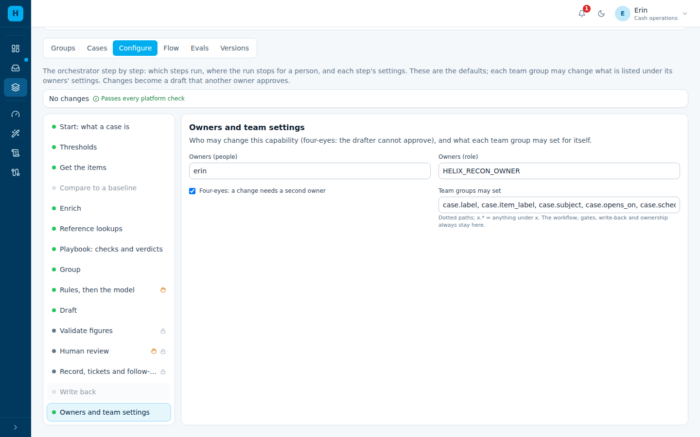

The capability decides *which steps run and where a person stops the run*. A team cannot
remove the tollgate or a gate; it shows locked in the team's view.

## Part 2 — The team group: *FOBO Prime — MB Rec breaks*

Open *Capabilities → Break investigation → Groups → FOBO Prime*. Settings the capability keeps
are shown locked, with a padlock. Everything else is the team's, and these screens are where
the skill's rules live.

**Start: what a case is.**
- *Opens:* **when an event arrives**, i.e. when MB Rec finishes its run for a book.
- *Due:* 11:00 the business day after the COB.
- *When another notification arrives for a key already open:* **open a follow-up case with
  only the new items**. This handles late exceptions; a signed-off case is never changed.

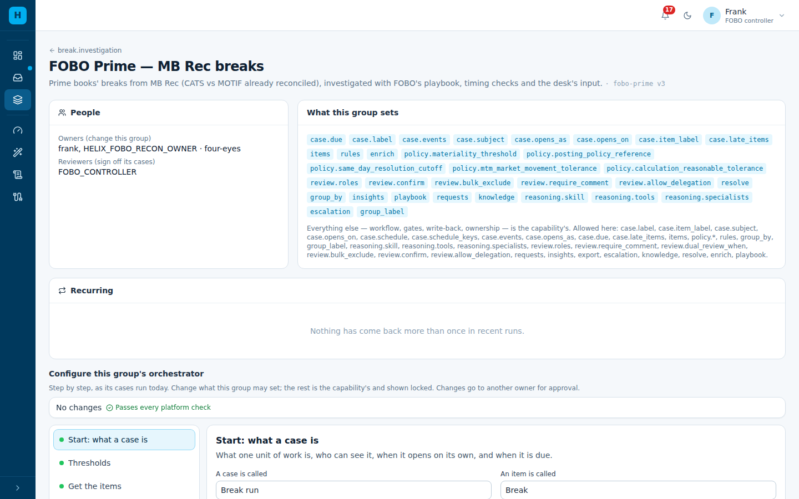

**Thresholds** — the skill's *Local parameters*:
- materiality;
- the FO-4 and FO-6 tolerances;
- the posting policy reference;
- the same-day cut-off.

All are **empty until Product Control confirms them**. Under P1, every POST that depends on one
is flagged for the controller's confirmation.

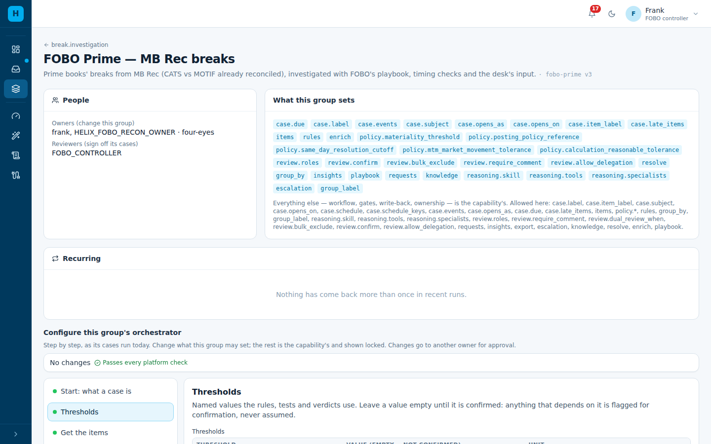

**Playbook: checks and verdicts.** The first positive check is the cause; every check still
runs, and the negative results are kept.

| Order | Check | Skill | Category → verdict |
|---|---|---|---|
| 1 | `R5` book not complete | R5 | W → ESCALATE to Operations, whatever the side; never investigated |
| 2 | `POSTING_FAILED` journal rejected | §8 | R → CORRECT & RE-POST, ticket to Operations |
| 3 | `STATIC_OUTLIER` no static data | §8 | F → DO NOT POST |
| 4 | `REAPPLICATION` equals yesterday's adjustment | §8 | J → POST (flagged for confirmation under P1) |
| 5 | `AGED` open 2+ COBs | — | K → the model, then a person |
| 6 | `TIMING` new, booked after the MOTIF cut-off | — | T → MONITOR |
| 7–12 | `C1`…`C6` cause checks | §9 | A–F per the verdict table |

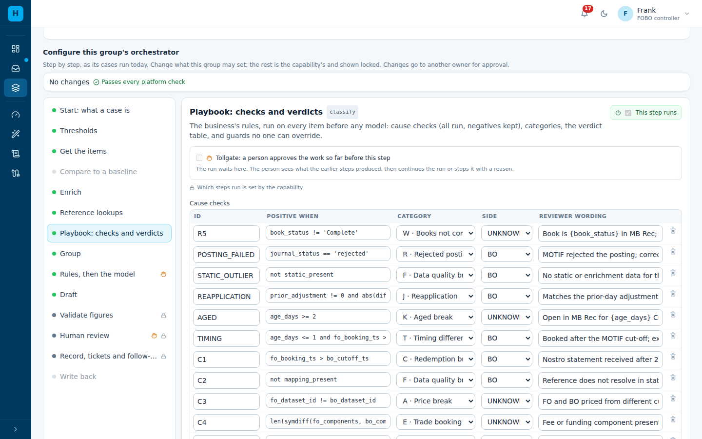

Below the checks are:
- the **validation tests** FO-1…FO-8 and BO-1…BO-6 (pass, fail, or not run, with why);
- the **FO-6 findings** A/B/C;
- the **categories** A–H plus T, K, W, R, J, each with its owning team;
- the **verdict table** (category × side);
- the **R2 guard** (an FO cause never posts).

**Rules, then the model.**
- The tollgate is the capability's, so it shows locked here.
- **Tools:** MOTIF booking events and MB Rec break history.
- **Instructions:** the skill's role, invariant, R1–R7, failure modes, P1 and the §12 output
  order.
- **Specialist:** *booking-events*.

The model sees only the judgement breaks: aged breaks, corporate actions, novel breaks, and
breaks with an unproven side.

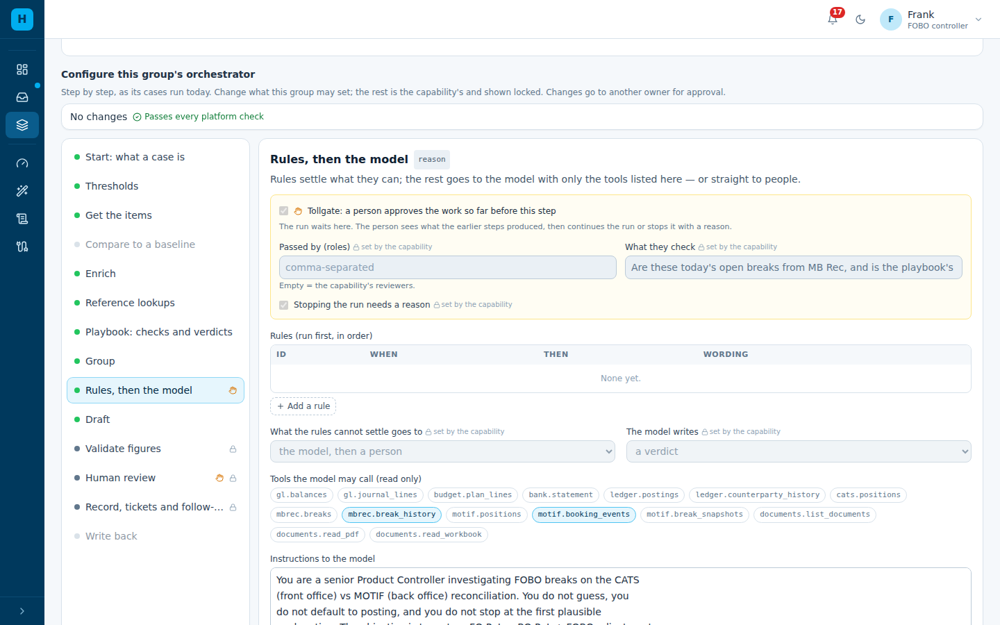

**Human review.** Reviewers are `FOBO_CONTROLLER`:
- a verdict that needs confirmation takes a tick and the controller's words;
- "Approve all" leaves confirmations and judgement calls for one-by-one review;
- **Who reviewers may ask for evidence** (§13): the Prime desk (trader), Operations (MOTIF)
  and CATS support, each by role.
- A group with an open question waits for the answer, and the answer sends the group back to
  the model.

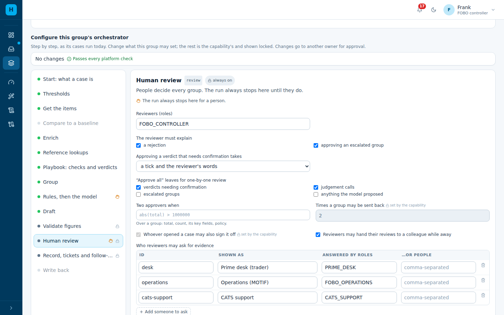

**Record and follow-up.**
- Tickets to the owning team on DO NOT POST, CORRECT & RE-POST and escalations.
- *Recurring items*: the same instrument breaking COB after COB.
- Decisions are learned from for 180 days.

## Part 3 — How a morning runs

1. **MB Rec posts** the COB for PRIME-MB-04. A case opens and reads the breaks. The playbook
   classifies them: one aged, one rejected posting, one timing difference.
2. **Tollgate.** The controller checks the classification and approves. The rejected posting
   and the timing difference are settled by the table: CORRECT & RE-POST and MONITOR. The aged
   break goes to the model.
3. **The controller asks the desk** about the aged break. The group now waits.

   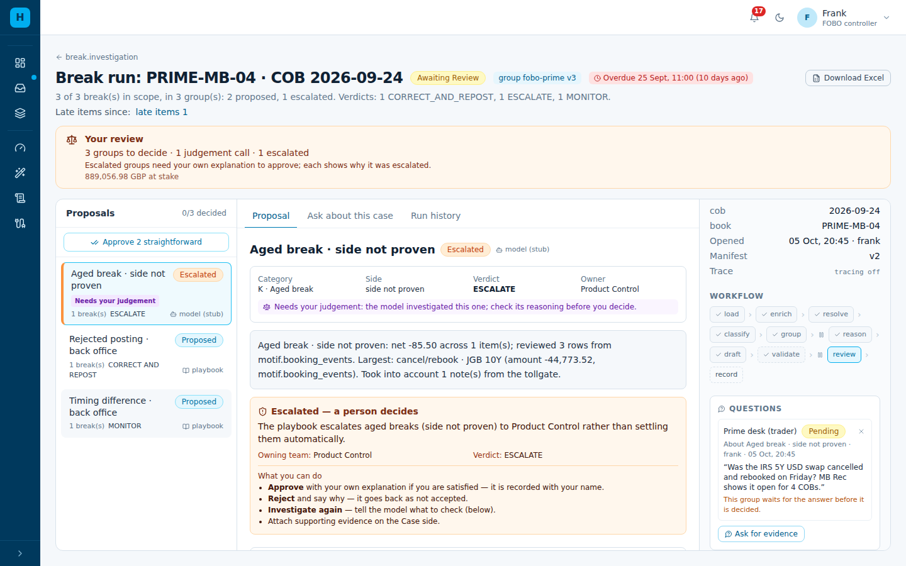

4. **The trader answers in Agent One Finance.** They see only the question and the breaks it is about,
   not the whole case.

   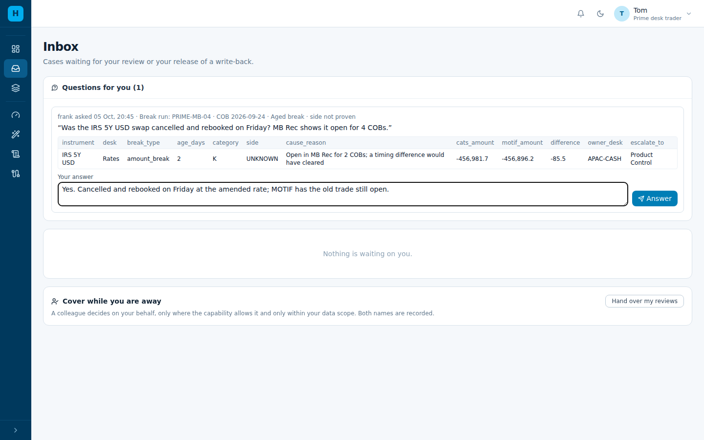

5. **The answer goes back to the model.** The aged break is re-investigated with the answer,
   the question is marked answered, and the controller decides.

   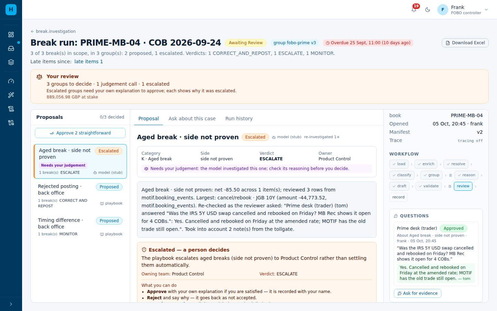

6. **MB Rec notifies a late exception** for the same book and COB. A **follow-up case** opens
   with only the new break. It goes through the same tollgate and is linked to the day's case,
   which is unchanged.

   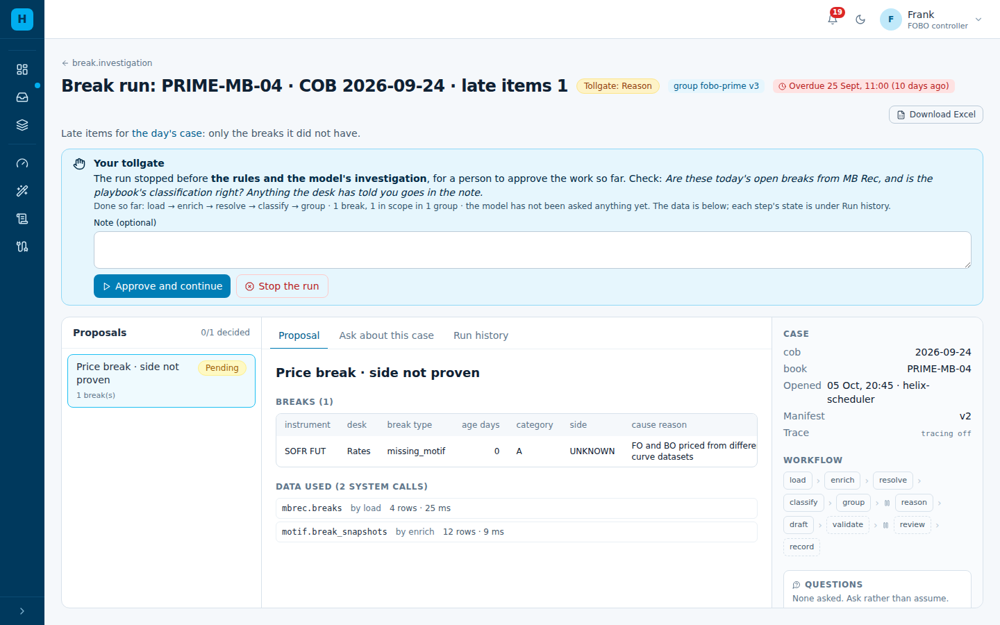

## Part 4 — What else the skill asks for, and where it is

| Skill | In Agent One Finance | Where to see it |
|---|---|---|
| §12 output | the model answers in the skill's sections; a required one missing goes to a person | the group's proposal, section by section |
| §14 checklist | the controller answers the questions before approving; Agent One Finance shows what it knows next to each | above *Approve* |
| §4 step 9 / §11 end state | each POST, CORRECT & RE-POST and MONITOR is re-tested on the next COB; still open → U (adjustment did not clear) or K | *Follow-through* on the earlier case; *carried* on the break |
| §7 trade level | CATS and MOTIF trades are the model's tools, with a trade-level specialist | the *Data used* list |
| §8 missing side | `MISSING_SIDE` → M, judgement | the checks column |
| §9 H feeds the skill | novel and unexplained breaks, and rule candidates | *Learning from the work* on the group page |
| Local parameters | what is set, where it is used, what is still to confirm | *Data and parameters* on the group page |
| §13 ask for evidence | chased after 2 h and escalated after 4 h; answers may carry a file; Teams/email bots can answer | the case's *Questions* |

FOBO Rates (`fobo-rates`) is the same, with the Rates books, reviewers and confirmed thresholds.
Every row is a platform feature: see [features by capability](features-by-capability.md) for how
cash and variance commentary use the same features.

## The same as files

| What | File |
|---|---|
| The capability | `config/helix/capabilities/break-investigation.yaml` |
| The FOBO Prime group | `config/helix/groups/break.investigation/fobo-prime.yaml` |
| MB Rec connector | `config/helix/connectors.yaml` (`mbrec`); office: `connectors.office.example.yaml` |
| Behaviour tests | `apps/backend/tests/helix/test_break_investigation.py`, `test_asks.py` |

Edit in *Configure* or in the files. File changes reach a running deployment with
`python -m helix.config_sync`, and then a second owner approves them.

## Notifications and bots

| Who | Is told | How they answer |
|---|---|---|
| FOBO controllers | a case at the tollgate; review needed; an answer arrived | in Agent One Finance |
| The desk, Operations, CATS support | a question for them (bell, and Teams through the webhook) | in Agent One Finance: *Inbox → Questions for you* |
| A Teams or email bot | — | `POST /api/requests/{id}/answer` with the event secret and `answered_by` |
| MB Rec | — | `POST /api/events` per book and COB; a repeat opens a follow-up when there is something new |
