# Helix user guide

**Date:** 2026-10-04 · For capability owners, preparers, reviewers and controllers.
Developers: see [`developer-guide.md`](developer-guide.md).

Every screenshot below comes from a real walk-through on the dev stack. A new capability,
**Accruals review**, is set up from nothing and run end to end. The FOBO CATS vs MOTIF Prime
and Rates groups then show the same screens for a reconciliation.

**Contents**

1. [The ideas in five lines](#1-the-ideas-in-five-lines)
2. [Who does what](#2-who-does-what)
3. [Find your way around](#3-find-your-way-around)
4. [Set up a capability](#4-set-up-a-capability)
5. [Run it: open a case](#5-run-it-open-a-case)
6. [Review and sign off](#6-review-and-sign-off)
7. [Team groups: FOBO Prime and Rates](#7-team-groups-fobo-prime-and-rates)
8. [Change a capability safely](#8-change-a-capability-safely)
9. [Operations, connectors and audit](#9-operations-connectors-and-audit)
10. [Everyday tasks](#10-everyday-tasks)

## 1. The ideas in five lines

| Term | Meaning | Example |
|---|---|---|
| **Capability** | A kind of work, written as configuration (a *manifest*) | Accruals review, Reconciliation investigation |
| **Team group** | One team's settings for a shared capability | CATS vs MOTIF — Rates |
| **Case** | One unit of work: one entity and period, or one book and COB | `UK01 accruals · 2026-09` |
| **Item / group** | Items are the lines in a case; similar items are grouped, and **one decision covers a whole group** | the accrual lines of account 6200 |
| **Connector** | A bank system served over MCP; Helix reads from and writes to it only through the gateway | `gl.balances`, `motif.positions` |

A case always runs the same steps: get the items, explain them (by rules, the playbook or
the model), check every figure, and **wait for a person**. Nothing is written back to a
system until people have approved it.

## 2. Who does what

| Role | Does | In the dev stack |
|---|---|---|
| Capability owner | Writes and changes the configuration | carol, bob (finance) · erin (recon) |
| Second owner | Approves a change; the drafter can never approve their own (four-eyes) | bob approves carol's draft |
| Group owner | Changes only their team's group | frank, gina (Prime) · rita, raj (Rates) |
| Preparer / opener | Opens cases (or the schedule opens them) | alice |
| Reviewer / controller | Approves or rejects each group, with a comment | bob · FOBO_CONTROLLER · FOBO_RATES_CONTROLLER |
| Releaser | Releases a write-back after review (four-eyes) | set per capability (`publish.approver_roles`) |
| Platform support | Off switches, connectors; **sees no case data** | pat |

You see only the cases inside your data scope. For example, alice sees UK01 only, and
rita sees only her four RATES-LDN books.

> **Dev only:** pick who you are from the user menu at the top right. In the office,
> your identity comes from SSO and your roles from the entitlements service.

## 3. Find your way around

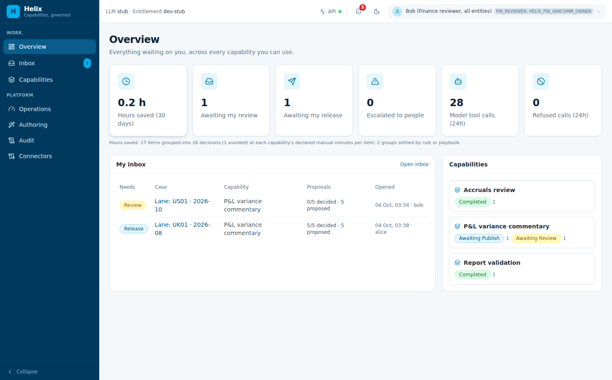

| Menu | What it is for |
|---|---|
| **Overview** | Your numbers: open cases, what is waiting on you, hours saved |
| **Inbox** | Every case waiting on *you*, across capabilities |
| **Capabilities** | The catalogue; open one to see its cases, groups, configuration, flow, versions |
| **Operations** | Health, runs, costs, the live tail of connector calls, off switches, schedules |
| **Authoring** | Create a capability by answering questions (no model), from a BRD (a model drafts), a template or YAML; approve drafts |
| **Audit** | Every connector call, allowed or refused |
| **Connectors** | The onboarded systems and their tools |

The bell shows notifications for review needed, release needed, published, failed and
escalated. The moon icon switches between the Barclays light and dark themes.

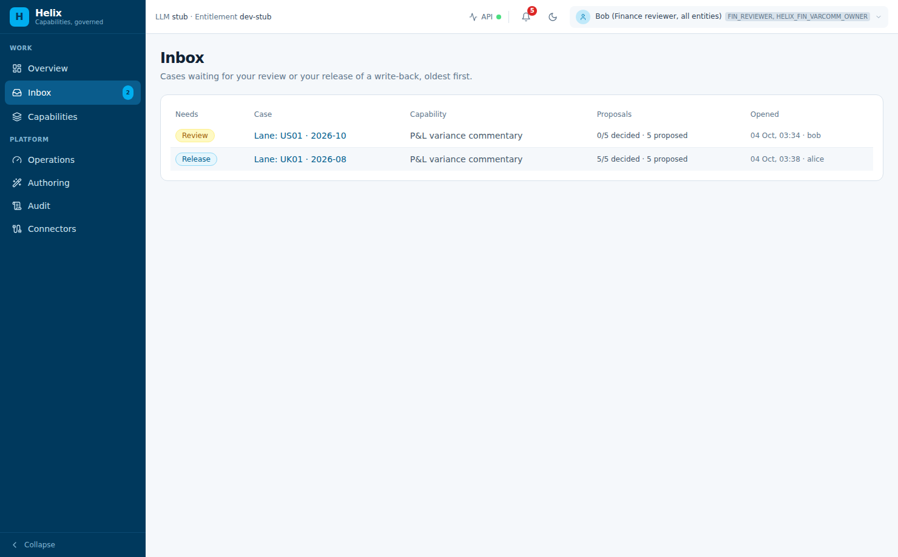

## 4. Set up a capability

You can start in any of these ways. Each one ends in a draft that **another owner approves**,
checked by the same platform validator.

| Start from | Needs a model? | When |
|---|---|---|
| **Answer questions** (the default tab) | No | You know the process; Helix asks what a case is, where items come from, whether to match two systems or investigate what another system found, what is material, how to group, who reviews, whether a model or a person settles what the rules cannot, a tollgate, who may be asked for evidence, a sign-off checklist and follow-through |
| **Describe it (BRD)** | Yes, to draft properly | You have a written requirement. With a model connected (the office Agent SDK), it drafts a full configuration. Without one, the tab says so and only picks the nearest template |
| **Template**: attestation, commentary, reconciliation, report validation | No | It is close to an existing pattern |
| **YAML**: paste a manifest, e.g. one from [`../examples/`](../examples/) | No | You already have it |

The tab you use is your choice. In a deployment with no model, *Answer questions* and
templates do everything, and the capability can still run without a model: choose *a person
(no model)* for what the rules cannot settle.

**Preparing the data.** In *Configure → Prepare the data*, add generic steps in the order the work
needs them:
- reference data (FX rates, limits);
- computed fields;
- filters;
- currency conversion;
- bands (ageing, service level);
- duplicates;
- roll-ups;
- your team's own tool.

Each step can run only when a condition holds. Items a step sets aside stay on the case with the
reason, and the case shows the data sets it used.

### Step 1: Draft (owner, e.g. carol)

1. Open *Authoring*.
2. Answer the questions and click **Build the capability**, describe the work and click
   *Draft capability*, or pick a template.

The draft appears on the right with its workflow, a check result ("Passes every platform
check", or a list of what to fix), and assumptions to confirm.

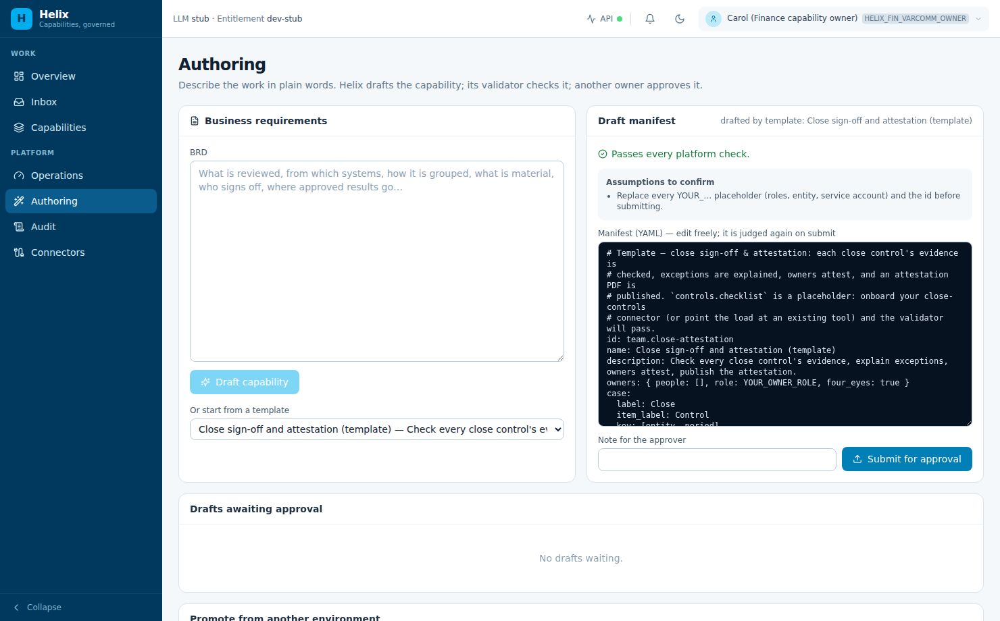

### Step 2: Edit and submit

Edit the YAML freely, add a note for the approver, and click **Submit for approval**. The
YAML is checked again on submit. The checks are:

- every tool is an onboarded connector tool;
- every expression is valid;
- the gates (validate, review, record) are present;
- the roles are set.

Here carol pasted [`accruals-review.yaml`](../examples/accruals-review.yaml):

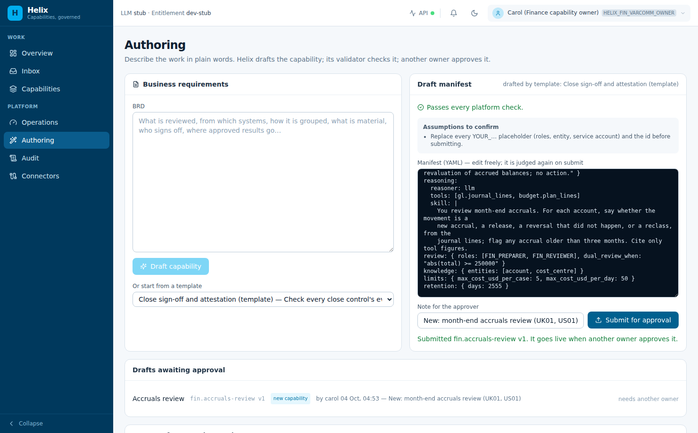

carol's own draft shows *needs another owner*. She cannot approve it.

### Step 3: Approve (a different owner, e.g. bob)

bob opens *Authoring → Drafts awaiting approval* and clicks **Approve**.

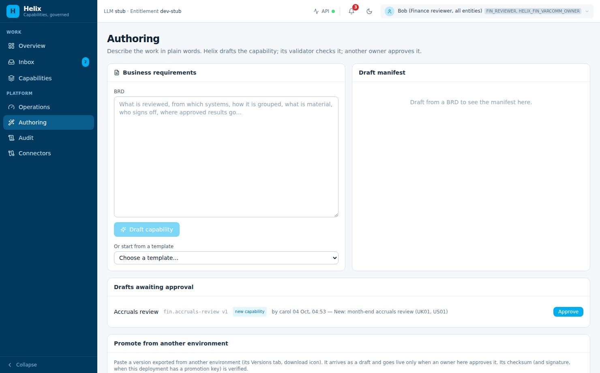

The capability is now live in the catalogue as **v1**:

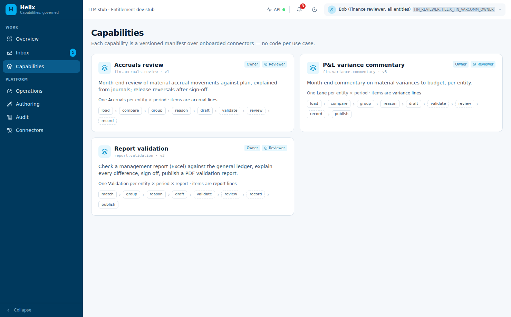

### Step 4: Look before you run

Each capability page has these tabs:

| Tab | Shows |
|---|---|
| **Cases** | Open a case; the list of cases |
| **Flow** | The workflow drawn from the manifest: tools per step, gates (bold), pauses for people, schedule |
| **Configure** | The orchestrator step by step: which steps run, where the run stops for a person, and every step's settings (see [§7a](#7a-configure-the-orchestrator)) |
| **Evals** | Replay past decided cases on a draft and score agreement before going live |
| **Versions** | Every version, who drafted and approved it, diffs, export for promotion |

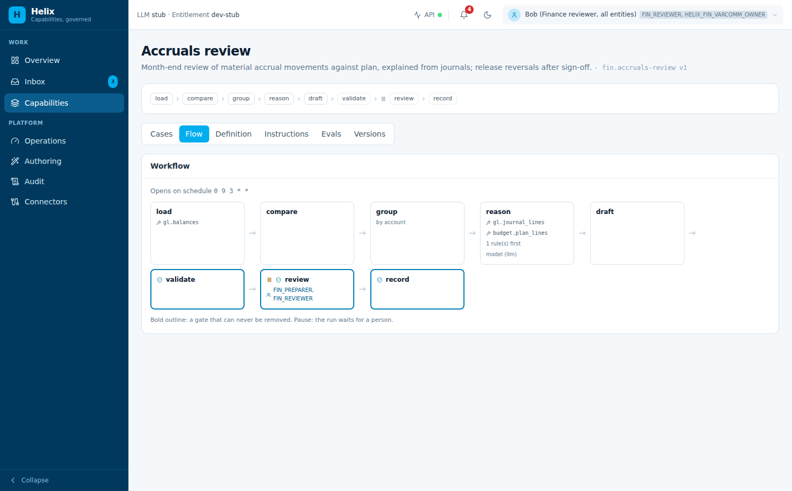

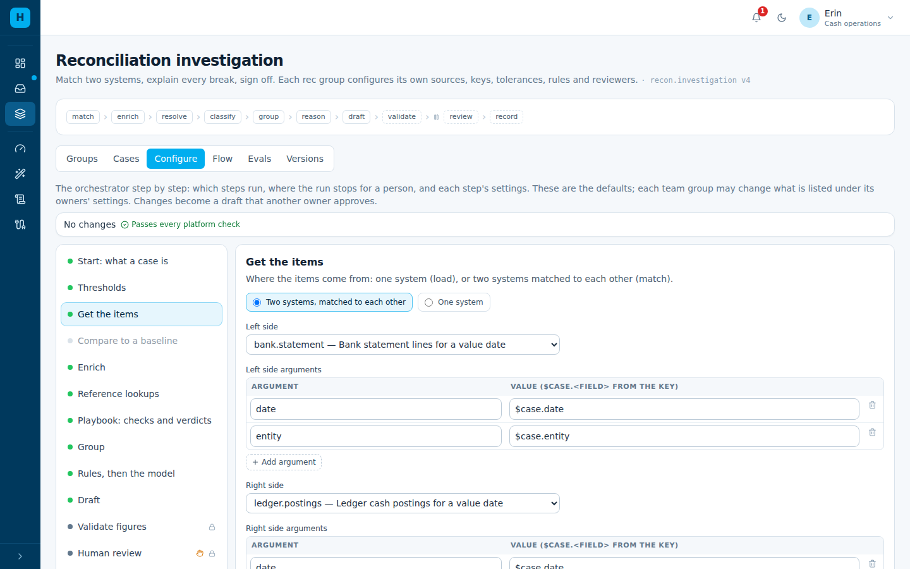

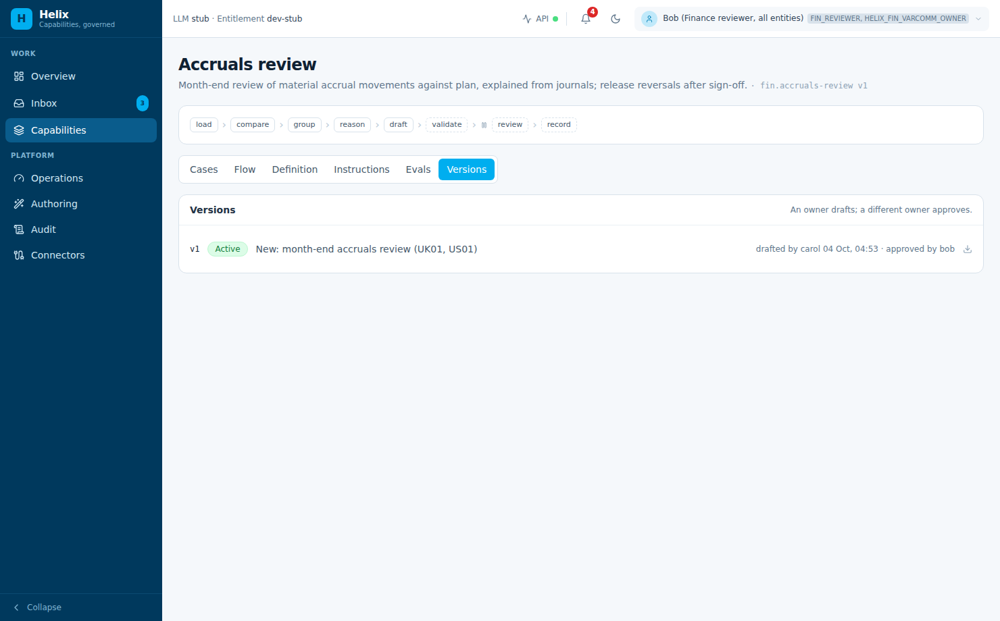

## 5. Run it: open a case

A case opens in one of four ways:

| How | Configured by |
|---|---|
| **By hand**: *Capability → Cases → Open a case* | always available to openers |
| **On a schedule**: e.g. 09:00 on the 3rd, or 06:30 on business days | `case.schedule` + `schedule_keys` (e.g. `{prev_month}`, `{prev_business_day}`) |
| **On an event**: another system says data has landed (`POST /api/events`) | `case.events: true` |
| **By API**: `POST /api/capabilities/{id}/cases` | always |

To open one by hand, alice (a preparer for UK01) fills in the case key and clicks **Open
and run**:

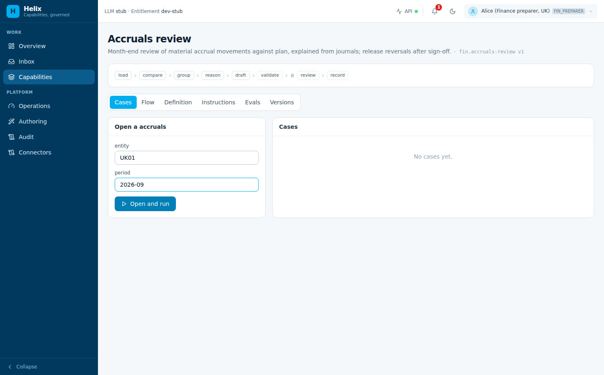

The run happens in the background. You can leave the page; the bell tells you when the case
needs review.

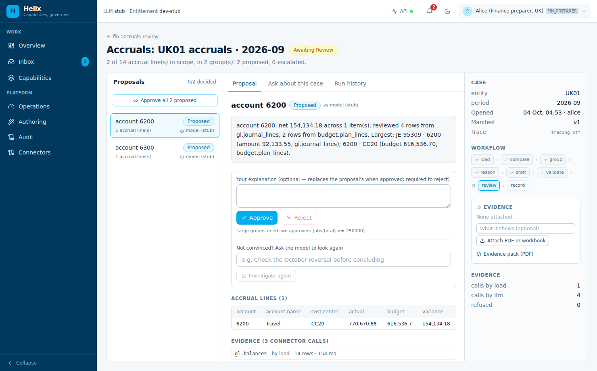

## 6. Review and sign off

The case workspace has three columns:

- **Left: proposals.** One per group, with its status (Proposed / Escalated), who proposed
  it (rule, playbook or model) and its verdict.
- **Middle: the selected proposal.** Its explanation, the lines behind it, and every
  connector call it used. The *Ask about this case* and *Run history* tabs are here too.
- **Right: the case.** Its key, manifest version, where the workflow is (a pause shows
  ⏸ **review**), evidence, legal hold, and call counts.

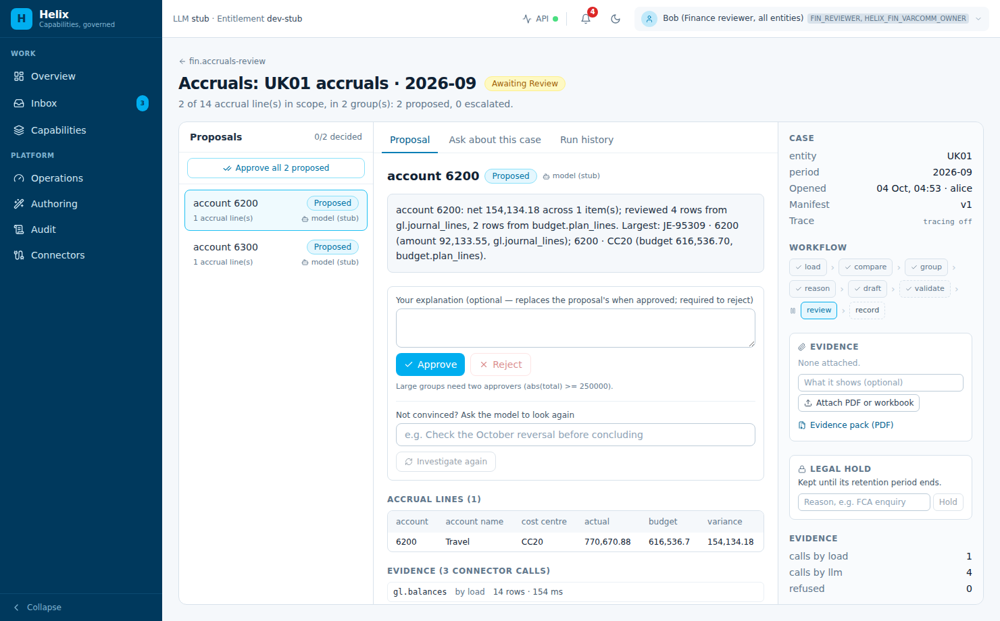

A reviewer (bob) can:

| Action | Notes |
|---|---|
| **Approve** a group | Optional explanation; it replaces the proposal's when given |
| **Reject** a group | A comment is required |
| **Approve all N proposed** | Bulk; escalated groups still need one-by-one decisions |
| **Investigate again** | Write what to check ("Check the October reversal"); the model looks again, up to `max_reinvestigations` |
| **Attach PDF or workbook** | Evidence is stored with the case and readable by the case's tools |
| **Evidence pack (PDF)** | One PDF for audit: configuration, findings, decisions, every data access, protection in force |
| **Legal hold** | Keeps the case beyond its retention period |

Some rules apply to every review:

- Large groups can need **two approvers** (`dual_review_when`, here at 250k or more).
- The person who opened the case may be barred from deciding (`opener_may_decide: false`).
- When every group is decided, the case is **recorded**.
- If the capability writes back (`publish`), a **second person releases** it, and only then
  is anything written. The write is idempotent.

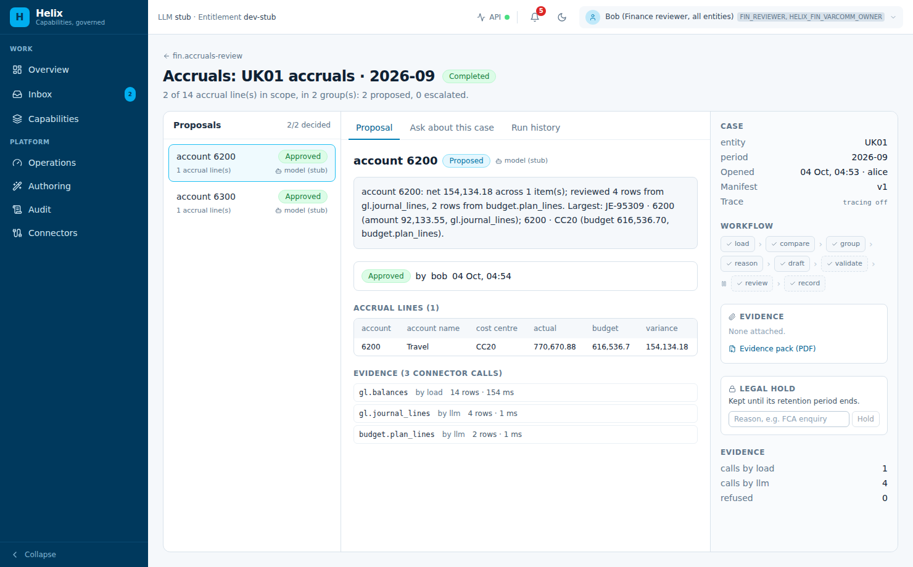

**Ask about this case** answers in plain words from the case's own data and read tools.
Every lookup is audited, and protected fields stay masked.

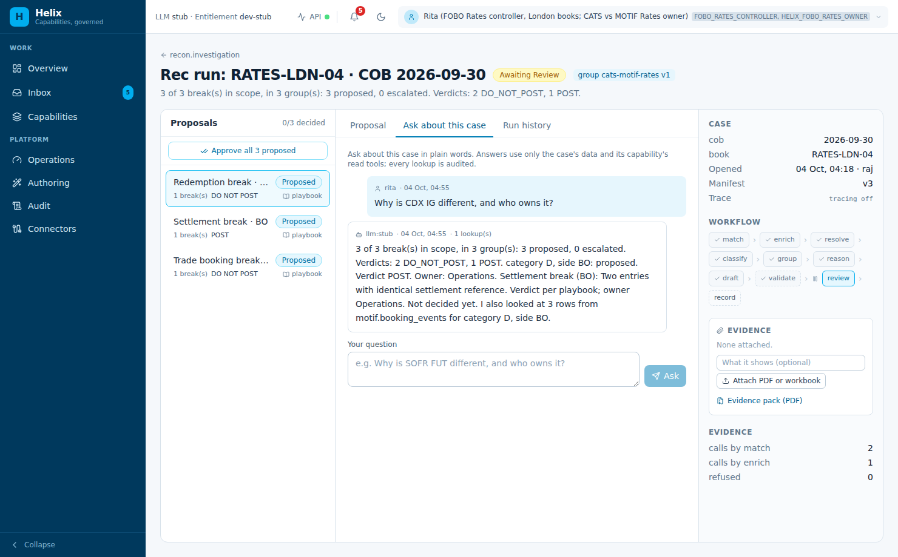

**Run history** shows each step, when it ran, and the state as it was at that moment.

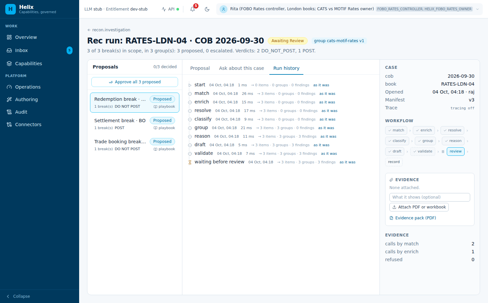

## 7. Team groups: FOBO Prime and Rates

*Reconciliation investigation* is one capability shared by several teams. Each group sets
only what the capability allows (`configurable`):

- sources;
- keys;
- tolerance;
- playbook;
- thresholds;
- instructions;
- reviewers;
- schedule.

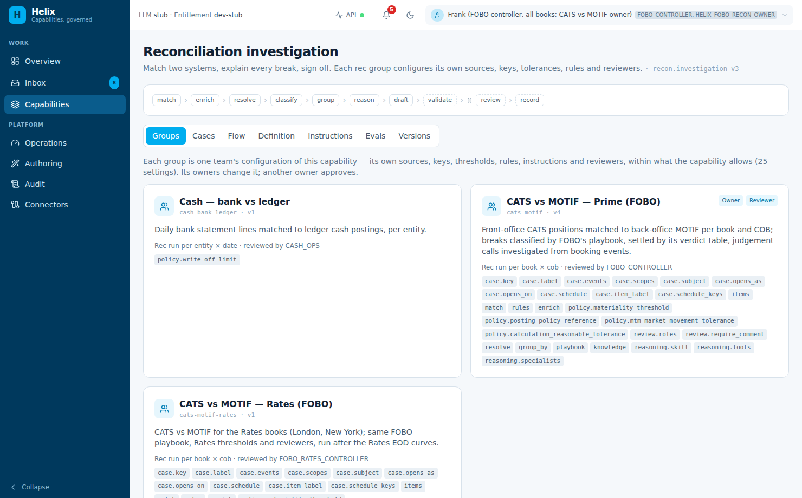

The group page shows its people, what the group sets, and the configuration its cases run
on:

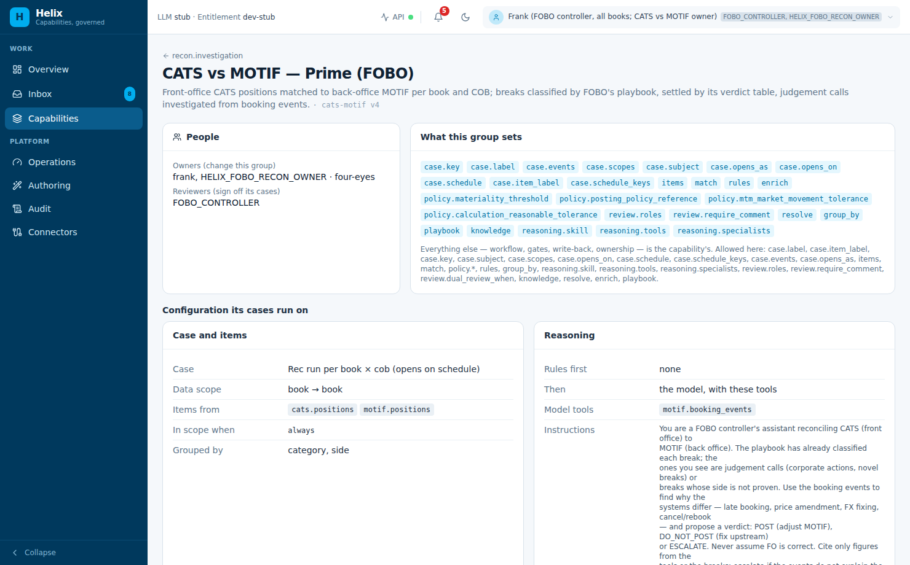
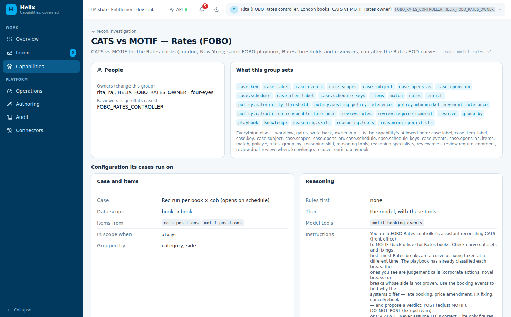

A FOBO case puts the playbook's work in the proposal header: **category, side, verdict and
owner**.

- **Prime, PRIME-MB-04.** A JGB missing in MOTIF is C/BO → POST, *requires controller
  confirmation* because Prime's thresholds are not set yet. An EURUSD forward is E/FO →
  DO NOT POST (fix at the desk).

  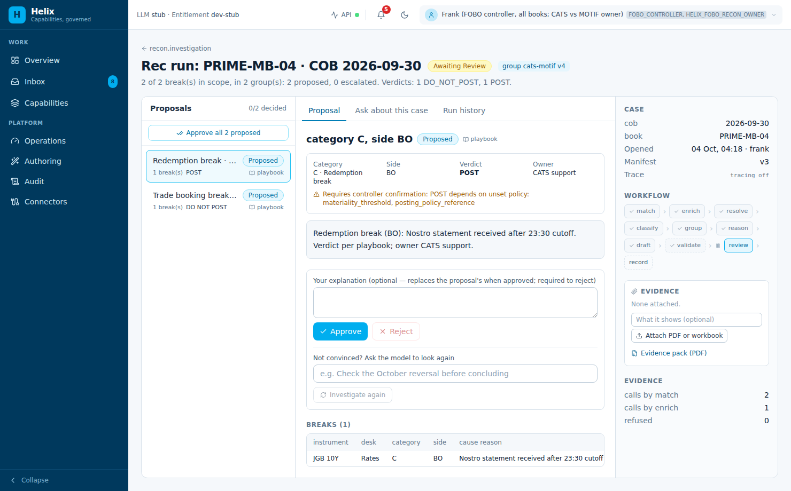

- **Rates, RATES-LDN-04.** ITRAXX MAIN is explained by test FO-6 finding A (pull factor
  event missing) → C/FO → DO NOT POST. CDX IG is D/BO → POST, *with no confirmation flag*,
  because Rates' thresholds are confirmed.

  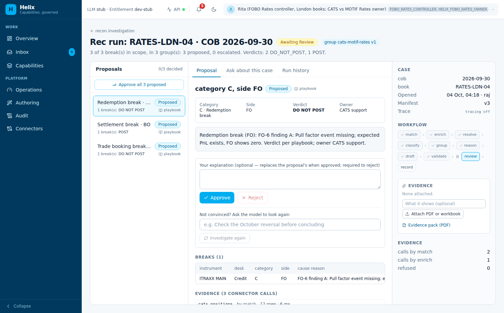

The full Prime vs Rates comparison and more cases are in [`../examples.md`](../examples.md).
The FOBO parity list is in [`../fobo-on-helix.md`](../fobo-on-helix.md).

The dark theme:

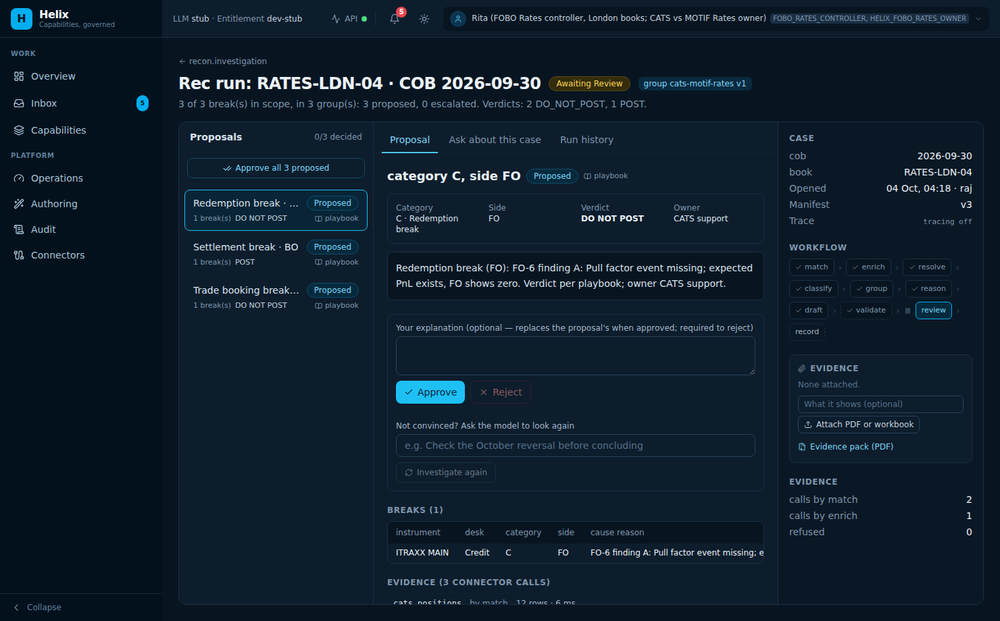

## 7a. Configure the orchestrator

The **Configure** tab of a capability, and the *Configure this group's orchestrator* section
of a group page, show the orchestrator one step at a time. Everyone can look; owners can
change it.

**On the left is the pipeline:**

| Mark | Meaning |
|---|---|
| Green dot | The step runs |
| Grey dot | The step is switched off |
| Lock | A gate: validate, review and record are always on |
| Hand | The run stops for a person before this step |
| Blue dot | You changed something in this step |
| Red number | Problems to fix in this step |

**On the right are the selected step's settings.** Choose from the lists rather than typing
YAML:

| Step | What you set |
|---|---|
| Start: what a case is | Its name, key, title, data scope, when it opens (manually, by API, on a schedule, by event) and its deadline |
| Thresholds | Named values. Leave one empty until it is confirmed: anything that depends on it is flagged for confirmation |
| Get the items | One system, or two systems matched: the tools, their arguments, the match keys and the tolerance |
| Enrich, Reference lookups | The extra reads joined onto the items, and the knowledge-graph lookups as of the business date |
| Playbook | Cause checks, categories, the verdict table (category × side), guards, validation tests, and which thresholds a verdict needs |
| Group | What items are grouped by, and how a group is named |
| Rules, then the model | Rules first; then the model or people; the model's tools (read only), instructions, specialists and spend caps |
| Human review | Reviewers, when an explanation is required, confirmation, what "Approve all" leaves out, two approvers, delegation |
| Record and follow-up | What decisions are learned across, tickets for owning teams, recurring items, Excel columns, retention |
| Write back | The write tool, one write per group or per case, and who releases it |
| Owners | Capability only: who may change it, and what each team group may set |

**Each edit is checked as you make it**, by the same checks a draft must pass. The bar at the
top says *Passes every platform check*, or how many problems there are. Each problem shows
on its step, in the server's words.

**When you are done,** choose *Review and submit*. You see every change as *before → after*.
Add a note and submit. This makes a draft. Another owner approves it under *Versions*, and
new cases use it from then on.

**Tollgates.** On any step after the first, *Tollgate* makes the run wait there for a person.
Set who passes it and what they should check. For example, a tollgate before *Rules, then the
model* means a reviewer approves the matched data before the model is asked anything:

- the case appears in their inbox as **Tollgate**;
- the case page shows what has been done so far, with **Approve and continue** and **Stop
  the run** (stopping needs a reason; the case can be re-run as a new attempt);
- every decision is recorded on the case.

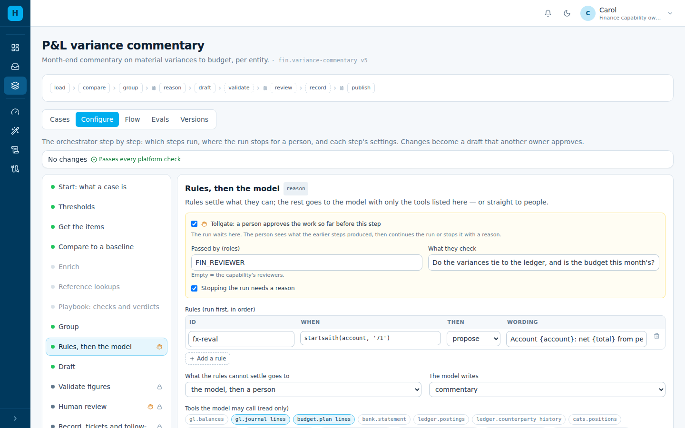

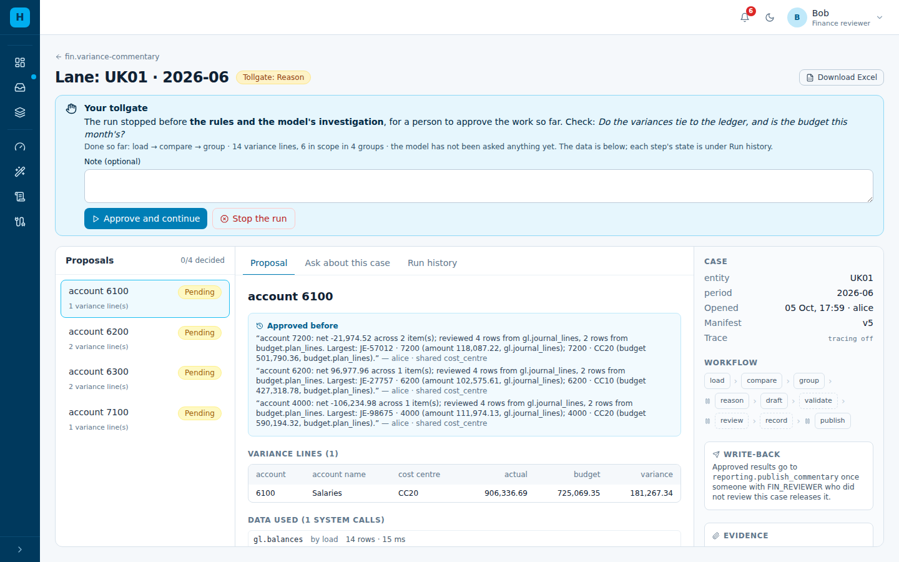

**A team group sees the same steps** with the capability's settings locked. For example,
which steps run is the capability's choice. The group changes only what the capability's
*configurable* list allows, and the draft holds only those paths.

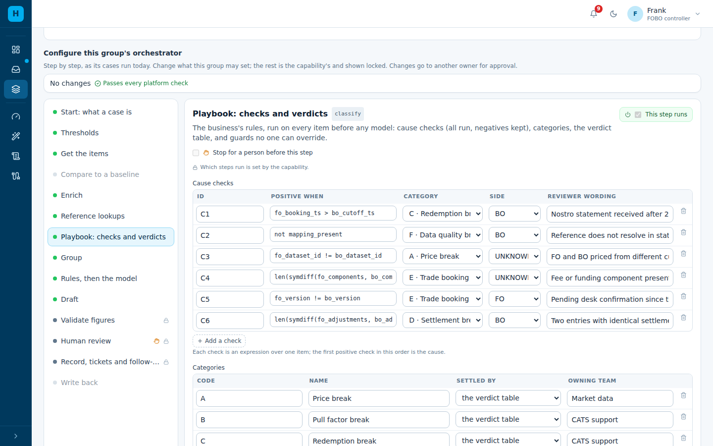

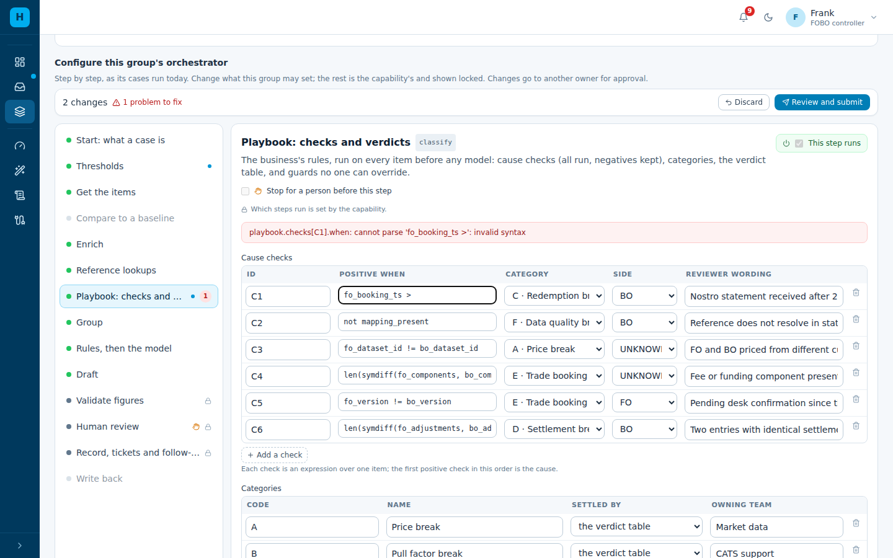

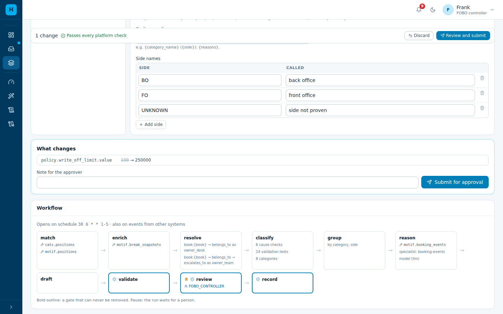

YAML is still there for those who prefer it: *Advanced: edit this group as YAML* on a group
page, and *Authoring* for a whole manifest.

## 8. Change a capability safely

1. **Draft** the change in one of these places:
   - the *Configure* tab, for the capability, step by step;
   - the group page, for one team's settings;
   - *Authoring*, for the whole manifest as YAML.
2. **Evals** (recommended). Shadow-run the draft on past decided cases. It writes nothing
   and reports agreement, verdict match and wording similarity.
3. **Approve.** A different owner approves the draft and reads the **diff** in *Versions*.
4. New cases run on the new version. **Past cases keep the version they ran on.**

To move a version from UAT to production, use *Versions → export* (a checksummed bundle,
signed when a key is set). Then use *Authoring → Promote from another environment*. It
arrives as a draft and is approved there again.

## 9. Operations, connectors and audit

**Operations** shows:

- health (DB, LLM, tracing, entitlements);
- runs, cost and errors in the last 24 hours;
- the fleet of groups, and what is waiting on people;
- a live tail of connector calls;
- **off switches**: turn off a capability, group or connector, with a reason;
- **schedules**.

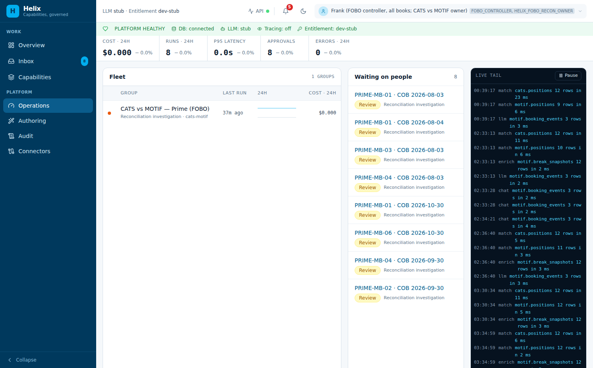

**Connectors** lists the onboarded systems and their tools. Only these tools can be used,
by any capability.

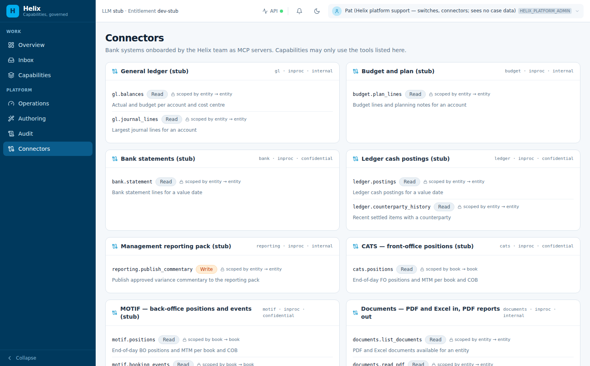

**Audit** lists every connector call: who, which tool, allowed or **refused**, rows, time.

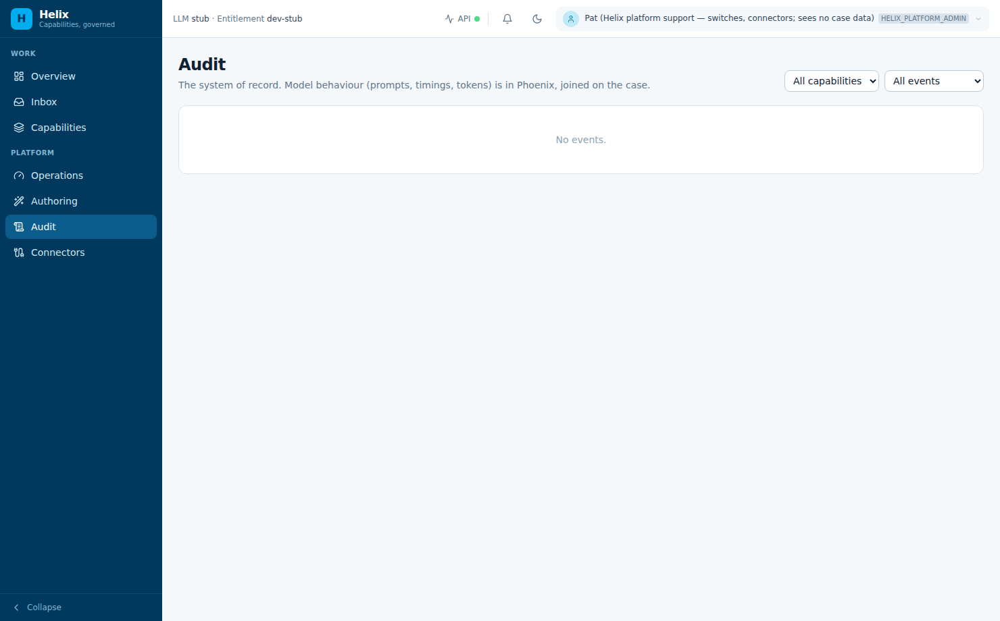

## 10. Everyday tasks

| I want to… | Do this |
|---|---|
| Work my queue | *Inbox* → open a case → decide each group |
| Re-run a case on new data | Case → *Re-run* (makes attempt 2; attempt 1 is kept) |
| Make the model look again at one group | Proposal → *Investigate again* with a note |
| Give auditors everything | Case → *Evidence pack (PDF)* |
| Stop a capability during an outage | *Operations → Off switches* → capability → reason → *Switch off* |
| Set a threshold Product Control just confirmed | Group page → edit `policy.<name>.value` → submit → the other owner approves |
| Add a new team to an existing capability | Add a group file (see the [developer guide](developer-guide.md#5-add-a-team-group)) |
| Add a new kind of work | *Authoring* → questions, BRD, template or YAML → submit → approve |
